Processing
==========
[TOC]

**Let op! Dit is de syllabus voor Processing zoals het gegeven werd t/m schooljaar 2021/2022. We werken aan een nieuwe versie voor 2022/2023 die binnenkort online komt.**

Visueel programmeren met Java.


Leerdoelen
==========

-   Het kunnen tekenen van basis figuren
-   Toepassen van Object-Georiënteerd programmeren
-   Snappen wat fractals zijn
-   Met recursie fractals kunnen tekenen
-   Het kunnen animeren van objecten
-   Een simpel spel kunnen maken

Introductie
===========

Inleiding
---------

Wat leuk dat je meedoet aan de Q-Highschool module Processing. In deze
module ga je werken in het Processing framework geschreven in Java. In
deze module focussen we op visueel programmeren, ofwel, met code iets op
het scherm laten verschijnen. Met deze module laten we de *magie van
code* zien, dat code niet alleen tekst is, maar dat het ook gebruikt kan
worden om mooie en leuke dingen te maken. We wensen alle deelnemers van
deze module veel plezier!

Opbouw module
-------------

Deze module bestaat uit 8 lesweken. In de eerste 6 weken leer je nieuwe
concepten, die je in de laatste twee weken gaat toepassen in een grotere
opdracht. Er wordt veel gebruik gemaakt de video's en de website van
Daniel Shiffman. Het is aan jezelf de aangeleverde bronnen worden te
gebruiken. Per week is er een lijst met voorbeeld-programma's
beschikbaar. We raden sterk aan dat je deze bekijkt, een beetje aanpast
en kijkt of je snapt wat er gebeurd. Verder zijn er veel
oefenopdrachten. Om de stof goed te begrijpen raden we sterk aan deze
opdrachten serieus te maken. Alle (voorbeeld) oplossingen van deze
opdrachten zijn gegeven. Probeer het altijd eerst zelf voordat je naar
de oplossingen kijkt. Om de twee weken is er een inleveropdracht (dus
vier in totaal). Deze worden voor een cijfer beoordeeld.

-   Er staat voor sommige opdrachten of stukken theorie [optioneel].
    Dit zijn opdrachten of stukken theorie voor als je het nog niet
    helemaal begrijpt, vind je de stof te snel gaan, maak dan deze
    opdrachten.
-   Voor sommige opdrachten staat [extra]. Dit zijn extra uitdagende
    opdrachten of stukken theorie die je de stof nog beter helpen
    begrijpen. Doe dit als je extra uitdaging zoekt!
-   Iedere inleveropdracht heeft ook delen waar [bonus] voor staat.
    Voor deze opdrachten zijn bonuspunten te verdienen.

Kennismaking & Inspiratie
-------------

Verzin allemaal een bijvoeglijk naamwoord met dezelfde letter als je
naam zoals: "Vage Victor" "Aardige Amber" Iedere persoon die zich
voorstelt noemt ook de namen van de vorige personen op.

Ga naar de website [Processing Sketches](https://www.openprocessing.org/browse)
Hier zijn een heleboel Processing sketches te vinden.
Je kunt hier zien dat je ook kunst kunt creëren met code! Bekijk er een
aantal en deel de coolste met je medeleerlingen!

Week 1
======

1.1 Leerdoelen
--------------

Deze week leer je omgaan met de volgende concepten:

-   Variabelen: `int`
-   Standaard functions:
    -   `size(int width, int height)`
    -   `circle(int x, int y, int r)`
    -   `random(float bound)`
    -   `stroke(float r, float g, float b)`
    -   `fill(float r, float g, float b)`
    -   `background(float r, float g, float b)`
    -   `strokeWeight(int w)`
-   Globale variabelen: `width, height, mouseX, mouseY`
-   Het aanroepen van functions
-   Het maken van eigen functions
-   Het gebruiken van for-loops
-   Standaard operatoren: `a + b, a - b, a \* b, a / b, a % b, a \^ b`

1.2 Uitleg
----------

-   <a href="https://hello.processing.org/editor/">Interactive Processing Editor</a>
-   [Optioneel] <a href="https://www.youtube.com/watch?v=2VLaIr5Ckbs&list=PLRqwX-V7Uu6ZYJC7L-r6rX6utt6wwJCyi">Introduction - Processing Tutorial</a>
-   <a href="https://www.youtube.com/watch?v=a562vsSI2Po&list=PLRqwX-V7Uu6bsRnSEJ9tRn4V_XCGXovs4">Pixels - Processing Tutorial</a>
-   <a href="https://www.youtube.com/watch?v=5N31KNgOO0g&list=PLRqwX-V7Uu6Yo4VdQ4ZTtqRQ1AE4t_Ep9">Processing Environment - Processing Tutorial</a>
-   <a href="https://www.youtube.com/watch?v=o8dffrZ86gs&list=PLRqwX-V7Uu6by61pbhdvyEpIeymlmnXzD">Interaction - Processing Tutorial</a> Alleen 3.1
-   <a href="https://www.youtube.com/watch?v=B-ycSR3ntik&list=PLRqwX-V7Uu6aFNOgoIMSbSYOkKNTo89uf">Variables - Processing Tutorial</a> Alleen 4.1

1.3 [optioneel] Voorbeelden
-----------------------------

Bekijk de volgende voorbeelden. Ga per regel na of je snapt wat er
gebeurd. Pas eventueel wat dingen aan om te kijken wat het effect is.
Als je codeert mag je het internet en de voorbeelden altijd gebruiken,
maak hier dus gebruik van!

### Chess

```java
void setup() {
    size(500,500); //set size of sketch
  	int size = 8; //make a variable how many by how many squares the board will be
  	
    int tileWidth = width / size; //determine the width of one tile
  	noStroke(); //disable the stroke, or outline when you draw
  
    for (int x = 0; x < size; x++) { //loop through all the x-tiles
        for (int y = 0; y < size; y++) { //loop through all the y-tiles
            // the % operator means remainder, so (x + y) % 2 == 0 checks if x + y is even. (And this happens to give a perfect chessboard)
            if ((x + y) % 2 == 0) {
                fill(0); //set the fill color to black
            } else {
                fill(255); //set the fill color to white
            }
            
  			rect(x * tileWidth,y * tileWidth, tileWidth, tileWidth); //draw a rectangle at the specified coordinates
 		}
  	}
}
  
void draw() {
}
```

### Houses

```java

final int HOUSE_WIDTH = 60;

void setup() {
	size(500, 500);
	for (int i = 0; i < (width / HOUSE_WIDTH) + 1; i++) {
	 	 drawHouse(i * HOUSE_WIDTH, height / 2);
	}
}

void drawHouse(int x, int y) {
	rect(x, y, HOUSE_WIDTH, HOUSE_WIDTH);
	triangle(x, y, x + (HOUSE_WIDTH / 2), y - HOUSE_WIDTH, x + HOUSE_WIDTH, y);
}

void draw() {
}

```

1.4 Opdrachten
------

Je gaat de eerste code schrijven! Zorg ervoor je een nieuwe **sketch** aanmaakt.

### <span class="exercise">1.4.1 Een cirkel</span>

Plak de volgende code in je lege sketch. Run de sketch om te kijken wat
dit doet!


```java

void setup ( ) {
	size (500 ,500) ;
	circle (100 ,100 ,70) ;
}

void draw ( ) {
}

```

Pas de code aan zodat de cirkel in het midden van het scherm staat.

! Oudere versies van Processing hebben geen `circle(x, y, radius)` functie. 
! Gebruik dan `ellipse(x, y, width, height)`
    
### <span class="exercise">1.4.2 Het midden</span>

Als je de grootte van het scherm aanpast (pas de arguments van `size`
aan), zul je zien dat de cirkel niet meer in het midden staat. Gebruik
de variabelen `width` en `height` om het midden van het scherm te
berekenen. Zorg ervoor dat de cirkel in het midden van het scherm blijft
staan, onafhankelijk van de grootte van het scherm.

### <span class="exercise">1.4.3 Een sneeuwpop</span>

Maak een sneeuwpop door twee cirkels half-boven de eerste cirkel te
tekenen.

### <span class="exercise">1.4.4 Een function</span>

Het tekenen van de sneeuwpop is een simpel **algoritme**. Als je een
programma wil maken is het belangrijk dat je het opdeelt. Dit opdelen
gebeurt onder meer door het maken van **functions**. Plaats de volgende
function *helemaal onderaan* je de sketch.

```java
void drawSnowman(int x, int y) {

}
```

Plaats de volgende regel code onderaan in setup.

```java
drawSnowman(int(random(width)), int(random(height)));
```

Verplaats het tekenen van je sneeuwpop naar de `drawSnowman` function.
Het is belangrijk dat je de sneeuwman op de coördinaten `x, y`
plaatst.

### <span class="exercise">1.4.5 Meer sneeuwpoppen</span>

Maak een `for` loop in de setup die 10 sneeuwpoppen op willekeurige
plekken op het scherm plaatst.

### <span class="exercise">1.4.6 Gekleurde sneeuwpoppen</span>

In de wereld van code kan alles! Waarom zouden we ons limiteren tot
witte sneeuwpoppen? Zorg ervoor dat alle sneeuwpoppen verschillende
kleuren hebben!

### <span class="exercise">1.4.7 Nog meer sneeuwpoppen</span>

Voeg de volgende function toe.

```java
void mouseClicked() {

}
```

Deze function word uitgevoerd op het moment dat je met de muis op de
sketch klikt. Zorg ervoor dat er een sneeuwpop op de plek van de muis
verschijnt als je klikt.

! Zoek op het internet naar een manier om de muis coördinaten te krijgen

### <span class="exercise">1.4.8 [Extra] Hogere sneeuwmannen</span>

Pas de function drawSnowman aan zodat er nog een derde variable is:

```java
void drawSnowman(int x, int y, int n) {}
```

Deze derde variable geeft de hoogte van de sneeuwpop aan. Zorg ervoor
dat ook de hoogte (het aantal cirkels) variabel is. Let op! De cirkels
moeten zowel kleiner worden, als boven op elkaar gestapeld worden. Zorg
dat je ook 100-ballen-hoge sneeuwpoppen kunt maken. Pas vervolgens `
drawSnowman(int(random(width)), int(random(height)));` aan zodat de
sneeuwpoppen tussen de 2 en 6 hoog zijn.

### <span class="exercise">1.4.9 [Extra] Sneeuwmannen dans</span>

Maak de function `makeCircle`, met als parameters een `int n`.

```java
void makeCircle(int n) {}
```

Deze function moet n sneeuwmannen in een cirkel om het midden van het
scherm tekenen. De sneeuwmannen moeten allemaal op gelijke afstand van
elkaar staan.

Week 2
======

2.1 Leerdoelen
--------------

-    x, y coördinaten om kunnen zetten in `PVector` objecten.
-   Gebruik kunnen maken van de volgende `PVector` methods:
    `add(PVector p)`, `sub(PVector p)`, `mult(float amount)` en
    `rotate(float angle)`.

2.2 Uitleg
----------

-   <a href="https://natureofcode.com/book/chapter-1-vectors/">Nature Of Code Chapter 1</a> Alleen 1.1, 1.2, 1.3, 1.4 en 1.5
-   <a href="https://www.youtube.com/watch?v=mWJkvxQXIa8&list=PLRqwX-V7Uu6ZwSmtE13iJBcoI-r4y7iEc">Vectors – The Nature of Code</a> Alleen 1.1, 1.2, 1.3 en 1.4

2.3 Voorbeelden
---------------

### 3.3.1 Star

```java
void setup() {
	size(300, 300);
}

void draw() {
	background(255);
    
	PVector mouse = new PVector(mouseX, mouseY);
	PVector line = new PVector(0, 100);

	int amount = 10;

	for (double i = 0; i < amount; i++) {
		PVector lineEnd = line.copy().add(mouse);
		line(mouse.x, mouse.y, lineEnd.x, lineEnd.y);
		line.rotate((PI * 2 / amount));
	}

}

```

### 3.3.2 Square

```java

void setup() {
	size(300,300);
	drawSquare(new PVector(width / 2,height / 2), new PVector(100, 0));
}

void drawSquare(PVector pos, PVector side) {
	PVector p2 = pos.copy().add(side);
	side.rotate(PI / 2);
    
	PVector p3 = p2.copy().add(side);
	side.rotate(PI / 2);
    
	PVector p4 = p3.copy().add(side);
    
	line(pos.x, pos.y, p2.x, p2.y);
	line(p2.x, p2.y, p3.x, p3.y);
	line(p3.x, p3.y, p4.x, p4.y);
	line(p4.x, p4.y, pos.x, pos.y);

}

void draw() {}

```

### 3.3.3 Forest

```java

void setup() {
	size(600,600);
	int amount = 7;

	for (int x = 0; x < amount; x++) {
		for (int y = 0; y < amount; y++) {
			int xPos = x * 60;
			int yPos = y * 60;
			tree(new PVector(xPos, yPos));
		}
	}

}

void tree(PVector pos) {
	strokeWeight(5);
    
	PVector trunk = new PVector(0, -60);
	PVector branch = new PVector(0, -30);
	PVector trunkTip = pos.copy().add(trunk);

	int numberOfBranches = 10;

	stroke(98, 43, 0);
	line(pos.x ,pos.y, trunkTip.x, trunkTip.y);
	branch.rotate(-PI / 2);
	stroke(16, 167, 0);

	for (int i = 0; i < numberOfBranches; i++) {
		PVector branchEnd = trunkTip.copy().add(branch);
		line(trunkTip.x, trunkTip.y, branchEnd.x, branchEnd.y);
		branch.rotate(PI / numberOfBranches);
	}

}

void draw() {
	if (mousePressed) {
		tree(new PVector(mouseX, mouseY));
	}
}

```

### 3.3.4 Flower

```java

void setup() {
    size(500,500);
    colorMode(HSB);
    drawFlower(new PVector(width/2,height/2));
}

void drawFlower(PVector p) {

    PVector trunk = new PVector(0,-150);
    PVector branch = new PVector(0,-25);

    PVector trunkAbs = p.copy().add(trunk);

    stroke(70,255,100);
    strokeWeight(10);

    line(p.x,p.y,trunkAbs.x,trunkAbs.y);

    noStroke();

    for (float angle = 0; angle < PI * 2; angle+=1) 
    {
        int c = int(angle * (255 / (2 * PI)));
        fill(c,255,255);
        branch.rotate(1);
        PVector leaf = p.copy().add(trunk).add(branch);
        circle(leaf.x,leaf.y,50);
    }

}
```

2.4 Opdrachten
--------------

Omdat het onhandig is om telkens twee argumenten mee te moeten geven
voor een positie op het scherm `int x`, `int y` en we een betere
manier nodig hebben om met coördinaten om te gaan bestaat er in
Processing de `PVector` class.

### <span class="exercise">3.4.1 [optioneel] Vectoren in de wiskunde</span>

Een vector is een verzameling van meerdere variabelen. Wij zullen ons
alleen maar bezig houden met 2 dimensionale vectoren van x, y
coördinaten. Een vector wordt als volgt genoteerd:


Er zijn een paar rekenregels, die erg voor de hand liggen als je bedenkt
dat een vector gewoon een verzameling van twee coördinaten is:

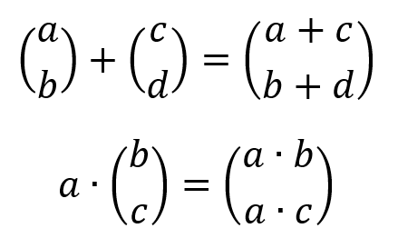

De tweede rekenregel heet scalaire vermenigvuldiging. Dit geeft het
uitrekken of inkrimpen van een vector weer. Dit is makkelijker te zien
als we de vectoren als pijltjes (of natuurkundige krachten) tekenen:

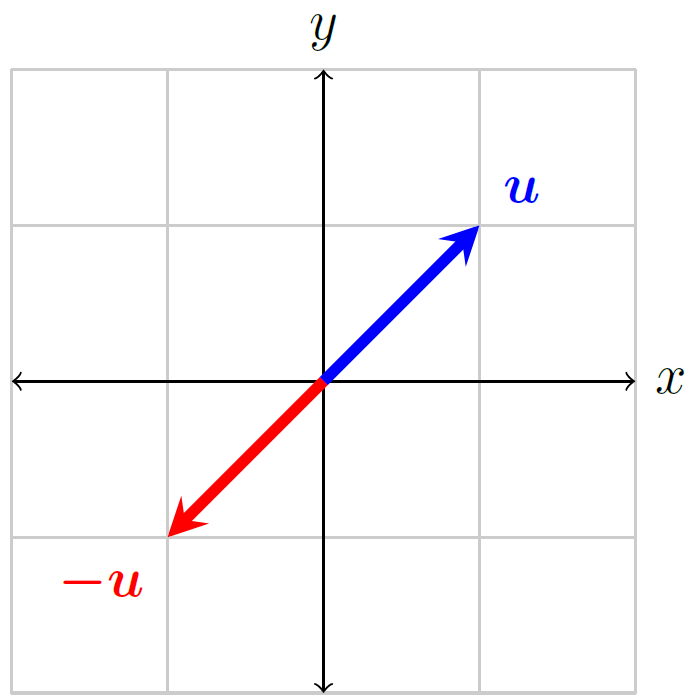

1.  Teken de optelling van $\binom{2}{1} + \binom{-1}{3}$
2.  Bereken $2 * ( ( 3 * \vec{a} ) + \vec{b} )$ met $\vec{a} =  \binom{1}{2}$ en $\vec{b} = \binom{-1}{2}$
4.  Bepaal het midden tussen $\vec{a}$ en
    $\vec{b}$. (We zoeken dus een algemene formule voor het
    midden tussen twee vectoren).
4.  Bereken de vector op $\binom{2}{3}$ afstand tussen
    $\vec{a}$ en $\vec{b}$. (Wederom zoeken we dus
    een algemene formule).

### <span class="exercise">3.4.2 [optioneel] PVector</span>

Processing heeft de class PVector, met daarin een heleboel handige
methods, zie voor uitleg de
<a href="https://processing.org/reference/PVector.html">reference</a>.

Op welke coördinaten tekent dit stukje code een stip? Schrijf je antwoord in een **comment** van je sketch.

```java

void setup() {
	PVector v1 = new PVector(3, 2);
	PVector v2 = v1.copy();

	v1.add(v2);
	v1.add(v2);

	v2.sub(new PVector(1, 1));
	v1.mult(3);

	drawDot(v1);
	drawDot(v2);
}

void drawDot(PVector v) {
	circle(v.x, v.y, 5);
}

```

! De oorsprong (0,0) zit bij computers links boven en niet links onder zoals bij de meeste wiskundige grafieken! 
! De y-as is als het ware gespiegeld.

### <span class="exercise">3.4.3 [optioneel] Vectoren gebruiken</span>

Nu je hebt geleerd wat een vector is wil je natuurlijk deze coole
vectoren voor alles gebruiken! Helaas accepteren de Processing functies
geen vectoren, alleen x en y coördinaten. Maak de volgende 3 functies
af, de functie `myLine` is al gegeven.

```java

void myLine(PVector v1, PVector v2) {
	line(v1.x, v1.y, v2.x, v2.y);
}

void myCircle(PVector v1, PVector v2) {
	// TODO
}

void myTriangle(PVector v1, PVector v2, PVector v3) {
	// TODO
}

```

### <span class="exercise">3.4.4 Een driehoek</span>

Maak de functie `betterTriangle(PVector p1, PVector side)`. Hierbij is
`p1` één van de hoekpunten en `side` één van de zijden.

! Kijk naar het voorbeeld `square`.


Figuur 3.1: Een driehoek met de vector `side` rood gekleurd

### <span class="exercise">3.4.5 Polygoon</span>

Een gelijkzijdige polygoon of veelhoek is een figuur met n hoeken en
lijnstukken van gelijke lengte. Voor n = 3 is dit een driehoek, voor n =
4 is dit een vierkant, voor n = 5 is dit een pentagon en voor n = 17 is
dit een heptadecagoon (zie figuur 3.2). Maak de functie
`polygon(PVector center, int radius, int n)`. Deze functie moet een
polygoon van `int n` hoeken tekenen met een straal van `int radius`.
Maak gebruik van vectoren en gebruik de `rotate(float angle` method.

! Een hoek wordt niet in graden uitgedrukt maar in radialen, dit betekent dat één cirkel (dus 360 graden) gelijk is aan $2 \bullet \pi$, ofwel: $2 \bullet PI$.

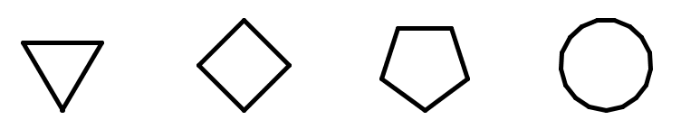

Figuur 3.2: Polygonen met n = 3, 4, 5 en 17

### <span class="exercise">3.4.6 Middelloodlijn</span>

Maak de functie `bisector(PVector p1, PVector p2)`. Deze functie moet
de middelloodlijn tekenen van de twee functies met de lengte gelijk aan
de afstand tussen de twee functies (zie figuur 3.3).

! Probeer eerst op papier een aantal middelloodlijnen te tekenen en probeer vervolgens om de twee punten waartussen de lijn getrokken moet worden te vinden.

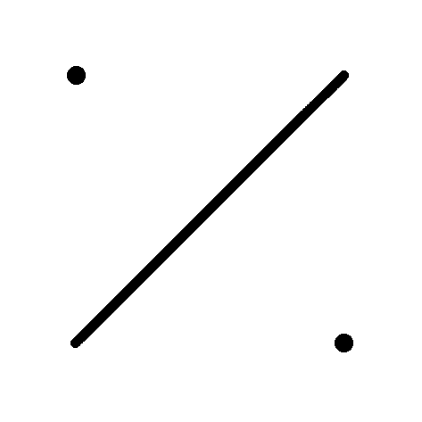

Figuur 3.3: Middelloodlijn, de twee stippen geven `p1` en `p2` aan.

Inleveropdracht 1
=================

### <span class="exercise">4.1 Koch’s Curve generatie 1</span>

Maak de functie `kochCurve(PVector p1, PVector p2)`. Deze functie
tekent de volgende figuur tussen `p1` en `p2`:

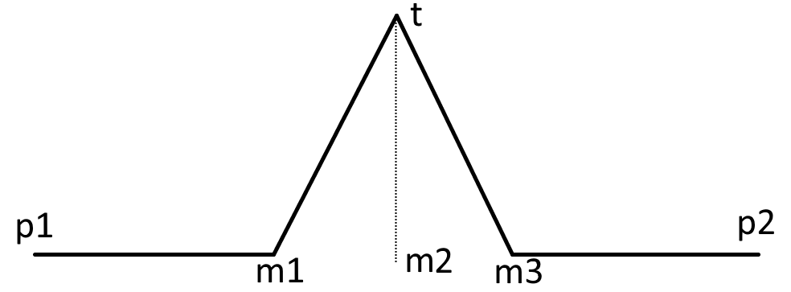

Figuur 4.1: Koch’s Curve gen 1

Hierbij ligt `m2` midden tussen `p1` en `p2`. De afstand tussen `p1` en `m1` is even groot als de afstand tussen `m2` en `t`. `m1` ligt op $\frac{1}{3}$ afstand van `p1` naar `p2`. `m3` ligt op $\frac{2}{3}$ afstand van `p1` naar `p2`.

! Dit is een redelijk complexe opdracht. Teken dit eerst uit, en probeer al voordat je begint met coderen te weten wat je precies gaat coderen. Maak gebruik van de `dist`, `rotate` en `mult` `PVector` methods.

###<span class="exercise">3.2 [bonus] Hilbert’s Curve</span>

Maak de functie `hilbertCurve(PVector p1, PVector p2)` die de volgende figuur tekent:

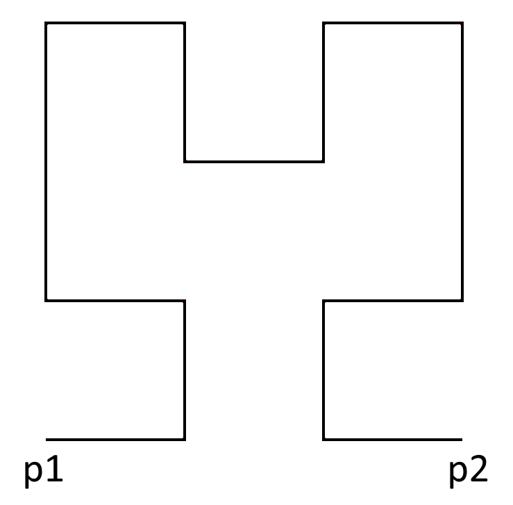

Figuur 4.2: Hilbert’s Curve

Week 3
======

3.1 Leerdoelen
--------------

-   Begrip voor het concept recursie
-   Het coderen van recursieve functies
-   Het kunnen tekenen van simpele fractals

3.2 Uitleg
----------

-   <a href="https://www.youtube.com/watch?v=-wiverLQl1Q&list=PLRqwX-V7Uu6bXUJvjnMWGU5SmjhI-OXef">Fractals
    – The Nature of Code</a>
    Alleen 8.1, 8.2 en 8.3\
    Bij 8.3 wordt er gebruik gemaakt van een `ArrayList` voor het
    maken van Koch’s Curve. Dit hoef je (nog) niet te kunnen.
-   <a href="https://natureofcode.com/book/chapter-8-fractals/">Nature of
    Code chapter 8</a>
    Alleen 8.1, 8.2, 8.3, 8.4 en 8.5\
    Bij 8.4 wordt er gebruik gemaakt van een `ArrayList` voor het
    maken van Koch’s Curve. Dit hoef je (nog) niet te kunnen.

3.3 Opdrachten
--------------

### <span class="exercise">5.3.1 [optioneel] Recursieve functies</span>

Recursieve functies zijn functies die een (makkelijkere) versie van
zichzelf gebruiken voor het bereken van een antwoord. Kijk bijvoorbeeld
naar:

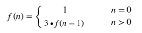

Deze functie geeft $f\left( n \right) = g^{n}$. Als we dit uitschrijven
krijgen we

Schrijf de uitwerking van $g(5)$ helemaal uit. Weet je ook welke functie
$g$ is?

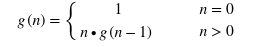

Schrijf de uitwerking van h(4) helemaal uit. Weet je ook welke functie
is?

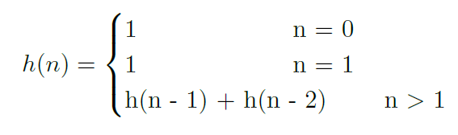

### <span class="exercise">5.3.2 Recursieve circles</span>

Als een functie zichzelf aanroept noemen we dit een recursieve aanroep.
Je kunt met recursie allerlei coole dingen tekenen. Een recursieve
functie moet wel ooit stoppen, daarom geef je vaak een getal mee int n
wat het aantal iteraties geeft, ofwel, hoe vaak de functie aangeroepen
wordt, of hoe "diep" de functie gaat. Pas de onderstaande code aan zodat
het resultaat lijkt op figuur 5.1.

```java

void recursiveCircles(int n, PVector pos) {
	if (n > 0) {
		circle(pos.x, pos.y, n \* 10);
		recursiveCircles(n – 1, pos);
	}
}

```

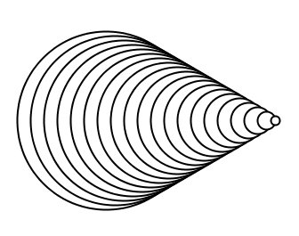

Figuur 5.1: Recursief getekende cirkels

### <span class="exercise">5.3.3 Maak een binary tree</span>

In deze opdracht ga je een binary tree maken (zie figuur 5.2). Een
binary tree bestaat uit één lijn, genaamd de stam (trunk). Vanuit de top
van deze stam "groeien" weer twee nieuwe stammen, alleen dan gedraaid
onder een hoek. Maak de functie binaryTree af.

```java

void binaryTree(int n, PVector pos, PVector trunk) {
	if (n > 0) {
		PVector tip = pos.copy().add(trunk);
		line(pos.x, pos.y, tip.x, tip.y);
	}
}

```

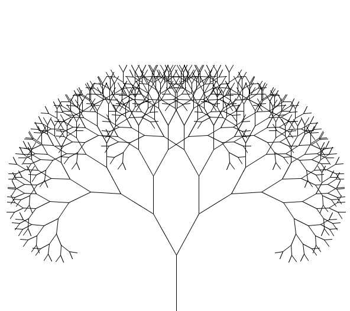

Figuur 5.2: Een binary tree

### <span class="exercise">5.3.4 Meer soorten trees!</span>

Vervang de hoek die je gebruikt hebt bij de vorige opdracht door
`((float) mouseX /width)`. Aanschouw de epische trees!

! Zorg ervoor dat je de functie aanroept in de `draw` functie.

Week 4
======

4.1 Leerdoelen
--------------

-   Ingewikkelde fractals kunnen tekenen
-   Snappen wat een L-System is
-   Extra: L-Systems kunnen gebruiken om fractals te tekenen

4.2 Uitleg
----------

-   <a href="https://www.youtube.com/watch?v=-wiverLQl1Qn&list=PLRqwX-V7Uu6bXUJvjnMWGU5SmjhI-OXefn&index=1">Fractals – The Nature of Code</a>
    Alleen 8.4, 8.5, \#14 en \#16
-   <a href="https://natureofcode.com/book/chapter-8-fractals/">Chapter 8. Fractals</a>
    Alleen 8.6

4.3 Opdrachten
--------------

Deze opdracht bestaat uit twee delen. Het eerste deel (het maken van een
Sierpinski Triangle) hoort nog bij de stof. En het tweede deel over
L-Systems is verdieping en hoef je niet te kunnen/kennen (hoewel het wel
super gaaf is!).

### <span class="exercise">6.3.1 Sierpinski Triangle</span>

Maak een functie die een Sierpinski Triangle tekent `sierpinski(int n,
PVector p1, PVector p2, PVector p3)`. Een Sierpinski Triangle (zie
figuur 6.1) bestaat uit een driehoek met hoekpunten `p1`, `p2` en
`p3`. Telkens wordt het midden van de zijden bepaald. Deze
middelpunten vormen samen met de originele hoekpunten 3 kleinere
driehoeken. Dit proces wordt `n` keer recursief herhaald zodat figuur
6.1 ontstaat!

Je mag gebruik maken van de volgende functie:

```java

PVector midpoint(PVector p1, PVector p2) {
	return p1.copy().add(p2).mult(0.5);
}

```


Figuur 6.1: Sierpinski’s Triangle met `n = 5`

### <span class="exercise">6.3.2 [extra] L-Systems</span>

Lees de paragraaf over L-Systems of bekijk de video's (zie het kopje
uitleg).

### Eerste L-System

```
Axiom = A

Rules:
	A -> B-A-B
	B -> A-B-A
    
```

De eerste generatie van dit L-System geeft `B-A-B`.

De tweede generatie geeft `A+B+A-B-A-B-A+B+A`.

Geef zelf de derde generatie.

### Tweede L-System

```
Axiom = F-G-G
Rules:
	F -> F-G+F+G-F
	G -> GG

```

Geef de tweede generatie van dit L-System. Het is een boel schrijfwerk,
maar het zeker waard!

### Turtle Graphics

We gaan nu zogenaamde turtle graphics toepassen op het tweede L-System.
Zet je pen op het papier en lees je antwoord van de vorige opdracht
letter voor letter:

-   Als je een F tegenkomt zet een streep van 1 cm (omhoog).
-   Als je een G tegenkomt zet een streep van 1 cm (omhoog).
-   Als je een + tegenkomt draai het papier 120 graden met de klok mee.
-   Als je een - tegenkomt draai het papier 120 graden tegen de klok in.

Als je verder wil spelen met deze L-Systems, je kunt heel veel leuke
dingen op het internet vinden. Begin op
<a href="http://www.kevs3d.co.uk/dev/lsystems/">deze website</a>

Inleveropdracht 2
=================

###<span class="exercise">7.1 Codeer Koch’s Curve</span>

Vandaag gaan we door middel van recursieve functies fractals tekenen! In
de vorige assignment heb je de functie `kochCurve` geschreven die de
figuur 7.1 tekent. Als je iedere lijn vervangt door deze zelfde figuur
krijg je de situatie van figuur 7.2. Als je dit oneindig vaak herhaalt
krijg je een fractal (zie figuur 7.3).


Figuur 7.1: Koch’s Curve generatie 1

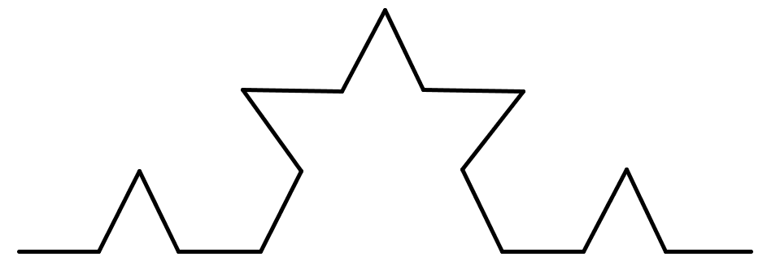

Figuur 7.2: Koch’s Curve generatie 2

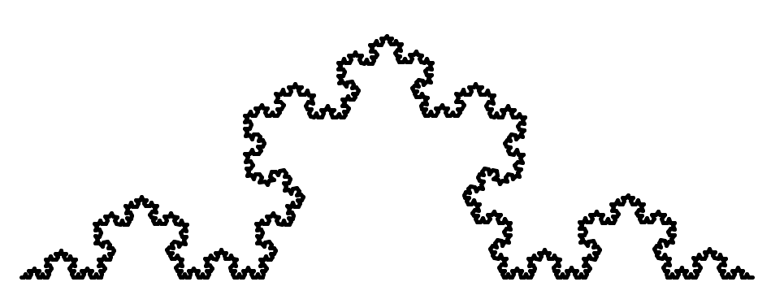

Figuur 7.3: Koch’s Curve Fractal (generatie ∞)

In deze opdracht ga je een functie schrijven die dit proces n keer
herhaald. Maak gebruik van de al geschreven functie `kochCurve` van de
vorige assignment.

```java
void kochCurve(int n, PVector p1, PVector p2) {
	if (n == 0) {
		line(p1.x, p1.y, p2.x, p2.y);
	} else {
		 //TODO
	}
}

```

### <span class="exercise">7.2 [bonus] Koch’s Snowflake</span>

Door Koch's curve een aantal keer te draaien ontstaat **Koch's Snowflake**.

```java
void kochSnowflake(int n, int sides, int r, PVector center) {
    // TODO
}
```

De parameters zijn:
-   `n`: het aantal iteraties van Koch’s curve.
-   `center`: het midden van de snowflake.
-   `sides`: het aantal zijden van de snowflake.
-   `r`: de radius van de snowflake.

! Gebruik de code die je hebt geschreven voor opdracht 3.4.5 Polygoon

De volgende code geeft als resultaat figuur 7.4:

```java

kochSnowflake(2, 5, 50, new PVector(100, 200));
kochSnowflake(5, 6, 100, new PVector(300, 200));
kochSnowflake(1, 6, 30, new PVector(500, 200));
kochSnowflake(3, 3, 100, new PVector(700, 200));

```

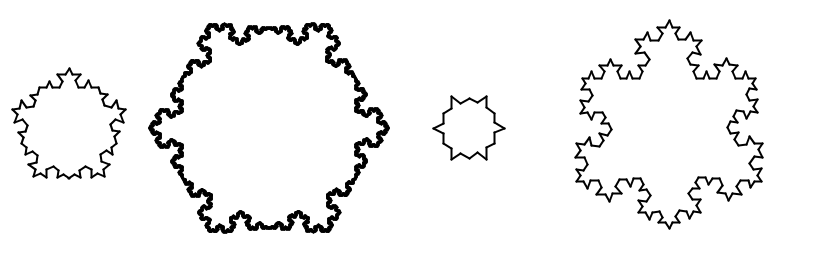

Figuur 7.4: Koch snowflakes!

Week 5
======

5.1 Leerdoelen
--------------

-   Het maken en gebruiken van classes
-   Het gebruiken van objecten (instances of classes)
-   Het maken van methods
-   Het werken met een ArrayList

5.2 Uitleg
----------

-   <a href="https://www.youtube.com/watch?v=YcbcfkLzgvs&list=PLRqwX-V7Uu6bb7z2IJaTlzwzIg_5yvL4i">8: Object-Oriented Programming</a>
-   <a href="https://www.youtube.com/watch?v=NptnmWvkbTw&list=PLRqwX-V7Uu6bO9RKxHObluh-aPgrrvb4a&index=1">9: Arrays en ArrayList</a>
-   <a href="https://processing.org/tutorials/objects/">Extra uitleg objecten</a>

5.3 Voorbeelden
---------------

### 8.3.1 Clouds

```java

ArrayList<Cloud> clouds = new ArrayList();
int time = 0;

void setup() {
	size(500, 500);
}

void draw() {
	background(76, 195, 255);
	if (time % 100 == 0) { //every 100 frames
		clouds.add(new Cloud());
	}

	for (Cloud curCloud : clouds) {
		curCloud.update();
		curCloud.show();
	}
    time++;
}

class Cloud {

	PVector pos = new PVector(-100, int(random(width)));
	PVector wind = new PVector(3, 0);

	void update() {
		pos.add(wind);
	}

	void show() {
		circle(pos.x - 40, pos.y + 10, 80);
		circle(pos.x + 40, pos.y + 10, 76);
		circle(pos.x, pos.y, 80);
	}

}

```

### 8.3.2 Ball

```java

Ball ball = new Ball();
ArrayList<Wall> walls = new ArrayList();

void setup() {
	size(500,500);
	Wall wallTop = new Wall(new PVector(0,0),new PVector(width,10));
	Wall wallRight = new Wall(
		new PVector(width - 10,0),
		new PVector(width - 10,height)
	);

	Wall wallBottom = new Wall(
		new PVector(0,height - 10),
		new PVector(width,height - 10)
	);

	walls.add(wallTop);
	walls.add(wallRight);
	walls.add(wallBottom);

}

void draw() {
	background(255);
}

class Ball {

	PVector pos;
	PVector vel;

	int radius = 50;

	Ball () {
		pos = new PVector(width / 2,height / 2);
		vel = new PVector(-10,2);
	}

	void move() {
		//TODO
	}

	void bounce() {
		//TODO
	}

}

class Wall {

	PVector topLeft;
	PVector bottomRight;

	Wall(PVector topLeft2, PVector bottomRight2) {
		topLeft = topLeft2;
		bottomRight = bottomRight2;
	}

	boolean intersects(Ball b) {
		//TODO
	}

	void show() {}

}

```

5.4 Opdrachten
--------------

Deze week gaan we voor het eerst *beweging* maken! Voortaan is het
belangrijk dat je alleen maar tekent in de draw functie. Het is extra
belangrijk dat je de uitlegvideo's over Object Georiënteerd Programmeren
bekijkt!

### <span class="exercise">8.4.1 Een class</span>

Het is handig om bepaalde variabelen en functies op die variabelen samen
in één object te bundelen. Hiervoor gebruiken we een **class**. In een
class kun je meerdere variabelen en functies stoppen. Zorg ervoor dat je
goed snapt hoe de volgende sketch werkt:

```java

Ball ball1;
Ball ball2;

void setup() {
	size(500, 500);
	ball1 = new Ball(new PVector(width / 2, height / 2));
	ball2 = new Ball(new PVector(width / 2, 0));
}

void draw() {
	background(255);
	ball1.move();
	ball1.draw();
	ball2.move();
	ball2.draw();
}

class Ball {
	// Variabelen van deze class
	PVector pos = new PVector(width / 2, height / 2);
	PVector gravity = new PVector(0, 5);
    
	// De constructor
	Ball(PVector beginPos) {
		 this.pos = beginPos;
	}

	void move() {
		pos.add(gravity);
	}

	void draw() {
		circle(pos.x, pos.y, 50);
	}

}

```

Pas de code aan zodat je naast de begin positie van de bal, ook de kleur
kan aangeven.

### <span class="exercise">8.4.2 Stuiterballen</span>

Pas de sketch aan door het volgende toe te voegen (en de method `move`
te vervangen).

```java
PVector bounceForce = new PVector(0, 0);

void move() {
	bounceIfBottom();
	pos.add(gravity);
	pos.add(bounceForce);
	bounceForce.mult(0.9);
}

void bounceIfBottom() {
	//TODO
}

```

De method `bounceIfBottom` moet de bal laten stuiteren als deze de
onderkant van het scherm raakt.

### <span class="exercise">8.4.3 Een ArrayList</span>

In het de sketch van de vorige opdracht worden er twee variabelen
gebruikt (`ball1` en `ball2`) om de ballen op te slaan. Maar wat nu
als we 4 ballen op willen slaan, of 100000? We willen niet een hele
lijst met variabelen maken natuurlijk. Daarom gebruiken we een
`ArrayList`. Pas je gemaakte sketch aan zodat je met behulp van een
`ArrayList` zoveel ballen kan maken als je wil! Pas vervolgens de code
aan zodat je 100 ballen op willekeurige plekken maakt!

! Je krijgt een willekeurig getal met `int(random(maximum hoeveelheid))`

Week 6
======

6.1 Leerdoelen
--------------

-   Omgaan met classes en objecten
-   Particles maken en updaten

6.2 Uitleg
----------

-   <a href="https://natureofcode.com/book/chapter-4-particle-systems/">Particle Systems – The Nature of Code</a>
    Alleen 4.1, 4.2, 4.3, 4.4 en 4.5
-   <a href="https://www.youtube.com/watch?v=vdgiqMkFygc&list=PLRqwX-V7Uu6Z9hI4mSgx2FlE5w8zvjmEy&index=1">Chapter 2. Particle Systems</a>
    Alleen 4.1, 4.2, 4.3, 4.4 en 4.5

6.3 Voorbeelden
---------------

### 9.3.1 Rain

```java
ArrayList<Particle> drops = new ArrayList();
PVector wind = new PVector(0, 0);

void setup() {
	size(500, 500);
	strokeWeight(3);
}

void draw() {
	wind = new PVector((-(width / 2) + mouseX) / 40, 0);
	for (int i = 0; i < 10; i++) {
		Particle newDrop = new Particle(
			new PVector(random(width + 400) - 200, -50)
		);
		drops.add(newDrop);
	}

	background(186, 204, 211);

	for (int i = drops.size() - 1; i >= 0; i--) {
		Particle p = drops.get(i);
		p.update();
		p.draw();
		 if (p.isDead()) {
			 drops.remove(p);
		}
	}

}

class Particle {
	PVector pos;
	PVector vel;
    
	int startColor;
	float lifetime;
	float maxLifetime = 255;
    
	Particle(PVector pos) {
		lifetime = maxLifetime;
		this.pos = pos;
		vel = new PVector(0, 4);
		startColor = color(0, random(120), 190 + random(60));
	}

	void update() {
		pos.add(vel);
		pos.add(wind);
		lifetime -= 2;
	}

	boolean isDead() {
		return lifetime <= 0;
	}

	void draw() {
		stroke(startColor,255 \* (lifetime / maxLifetime));
		line(pos.x, pos.y, pos.x + wind.x, pos.y + 20);
	}

}

```

6.4 Opdrachten
--------------

In deze opdracht ga je vuur maken! Dit gaan je doen door een **particle system** te maken (zie uitleg en figuur 9.1).

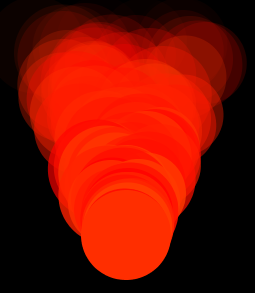

Figuur 9.1: Vuur!

### <span class="exercise">9.4.1 Een particle</span>

Maak een **Particle** class. Bedenk zelf welke variabelen en methods
deze class waarschijnlijk moet hebben. Kijk naar figuur 9.1, welke
eigenschappen heeft één vuurdeeltje?

### <span class="exercise">9.4.2 Het tekenen</span>

Maak een `ArrayList` van particles en zorg ervoor dat alle particles.
Voeg hier één particle aan toe (in de `setup` functie). Zorg er
vervolgens voor dat alle particles getekent worden (doe dit uiteraard in
de `draw` method).

### <span class="exercise">9.4.3 Het updaten</span>

Maak een `update` method in particle die ervoor zorgt dat de deeltjes
omhoog vliegen en een klein beetje naar links of rechts.

! Het is hier dus super handig als je gebruik maakt van een PVector.

### <span class="exercise">9.4.4 Lifetime</span>

We willen dat één vuurdeeltje na een tijdje verdwijnt. Dit kun je doen
door een variable `float lifetime = 255` te maken. Elke update haal je
hier 1 van af met `lifetime--`. Vervolgens moet je tijdens het updaten
checken of `lifetime < 0`. Is dit het geval, dan moet je het
deeltje uit de `ArrayList` te halen (`particles.remove(particle)`,
waarbij `particles` de `ArrayList` is, en `particle` het deeltje
wat je wil weghalen).

### <span class="exercise">9.4.5 Kleur veranderen</span>

Zorg ervoor dat de vuur deeltjes meer doorzichtig worden naarmate ze
korter te leven hebben.

! Gebruik `fill(color, alpha)` waar bijvoorbeeld `color = color(255,50, 0)` en `alpha` tussen `0` en `255`.

### <span class="exercise">9.4.6 Vuur!</span>

Voeg elke keer dat `draw` wordt aangeroepen een nieuwe `particle`
toe aan de `ArrayList` zodat een prachtig vuur ontstaat!

### <span class="exercise">9.4.7 [extra] Extra mooi vuur</span>

Als je wilt kun je ook nog extra dingen toevoegen:

-   Dat de grootte van de vuur deeltjes verschillend is
-   Dat de kleur van de vuur deeltjes verschillend is
-   Dat het vuur je muis volgt
-   Dat je meerdere vuurtjes kunt maken

Inleveropdracht 3
=================

<span class="exercise">10.1 Pong</span>
------------------------------

Voor deze opdracht ga je het klassieke spel Pong maken. Als je nog nooit
gehoord hebt van dit spel moet je het even opzoeken om te weten waar we
het over hebben (zoek op pong game). Je sketch moet minimaal aan de
volgende eisen voldoen. Je bent verder helemaal vrij extra
functionaliteit toe te voegen:

-   Een bal
-   Een door de gebruiker bestuurbaar batje
-   Stuiter-functionaliteit

Om je een beetje te helpen staat er onderaan een stappenplan. Je hoeft
dit niet te volgen, maar het is wel aan te raden als je het moeilijk
vind.

Gebruik het volgende opzetje:

```java

ArrayList<Wall> walls = new ArrayList();
Wall paddle;
Ball ball;

void setup() {
	size(500, 500);
    
	Wall top = new Wall(0, 0, width, 20);
	Wall right = new Wall(width – 20, 0, width – 20, height);
	Wall bottom = new Wall(0, height – 20, width, height – 20);
	paddle = new Wall(0, height / 3, 20, height / 4);

	walls.add(top);
	walls.add(right);
	walls.add(bottom);
	walls.add(paddle);

	ball = new Ball();
}

void draw() {
	background(255);

	for (Wall w: walls) {
		w.draw();
		ball.bounceIfHits(w);
	}

	ball.draw();
	ball.move();
}

```

Maak de `Wall` class:

```java

class Wall {
	int x; 			// x-position
	int y; 			// y-position
	int w; 		   // width
	int h; 			// height

	Wall(int x, int y, int w, int h) {
		//TODO
	}

	void draw() {
		//TODO
	}

}

```

! Test je code nu al, anders moet je straks een heleboel bugs oplossen!

Maak de `Ball` class:

```java

class Ball {
	PVector pos;
	PVector vel;

	int radius = 20;

	Ball() {
		//TODO
	}

	void move() {
		//TODO
	}

	void bounceIfHits(Wall w) {
		//TODO
	}

	 void draw() {
		//TODO
	}
}

```

Maak als laatste de besturing van `paddle`!

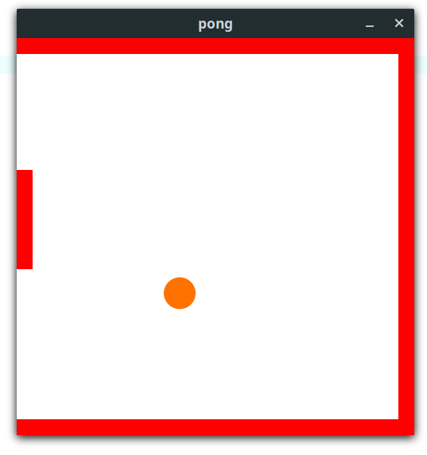

Figuur 10.1: Een voorbeeld van Pong

### <span class="exercise">10.2 [bonus] Extra functionaliteit</span>

Voeg extra features aan je sketch toe. Hieronder is een lijst met
voorbeelden van extra functionaliteiten, Je mag natuurlijk ook zelf iets
leuks bedenken.

-   Restarten: Het starten en opnieuw spelen van het spel in je programma zelf ipv de start- en stopknop van Processing te gebruiken.
-   Geef het batje een andere kleur (gebruik inheritance)
-   Het bijhouden en op het het scherm tonen van de score
-   Meerdere ballen tegelijk
-   Multiplayer (geef de andere speler twee andere toetsen)
-   Power-ups
-   Meerdere levels

Inleveropdracht 4
=================

### <span class="exercise">Maak je eigen game!</span>

Voor deze laatste inlever opdracht ga je een eigen game maken! Leg de
lat niet al te hoog, een game maken kost namelijk heel veel tijd. Ik heb
onderaan een lijstje gemaakt van spellen die je na zou kunnen maken, of
bedenk zelf een leuk spel!

-   Asteroids
-   Frogger
-   <a href="https://chromedino.com/">Het dinosaurus spel van Google
    Chrome</a>
-   <a href=" https://flappybird.io/">Flappy Bird</a>

Probeer Object Georiënteerd te programmeren. Bedenk voordat je begint
met typen eerst welke objecten je nodig hebt, welke methods en variables
die objecten hebben, en wat er verder nog nodig is voor je spel. Zorg er
dus voor dat je al weet wat je gaat maken voordat je begint met typen.
Verder is het erg handig om wat dingen uit te tekenen, dit geeft een
beter beeld van wat je wil bereiken!
