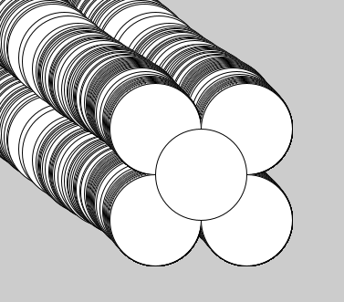

# Creatief Programmeren met Processing


[TOC]

Welkom bij de module Creatief Programmeren met Processing! In deze module ga je aan de slag met de programmeertaal [Processing](https://processing.org/), waarmee je creatieve visuele programma’s en animaties kunt maken. Je leert ook hoe je een programma uit kleinere blokjes kunt opbouwen met objectgeoriënteerd programmeren. Daardoor kun je ook een groot en ingewikkeld programma overzichtelijk houden, waardoor het voor anderen (en voor jezelf volgende week) makkelijker te begrijpen is hoe het programma werkt.

## Voorkennis

Als je aan deze module begint, gaan we ervan uit dat je al een beetje ervaring hebt met programmeren. Bijvoorbeeld uit de module Basis van Programmeren met Python, maar via een andere weg in een andere taal is natuurlijk ook goed. We verwachten dat je bekend met variabelen, print-statements, if- en else-statements en loops. Het is niet erg als dat een beetje is weggezakt: in de eerste lessen gaan we al deze onderwerpen herhalen en vertalen naar Processing. We hebben echter geen tijd om hier uitgebreid mee te oefenen, dus als je deze termen voor het eerst hoort, wordt dit een lastige module!

## Leerdoelen

Aan het eind van deze module kun je ... 

- creatieve en interactieve programma’s creëren met Processing.
- de basisprincipes van objectgeoriënteerd programmeren toepassen in je eigen programma’s.

Als je zelf nog meer leerdoelen hebt die je in deze module wilt bereiken, dan is dat natuurlijk ook goed! Laat het vooral weten, dan proberen wij je daar zo veel mogelijk bij te helpen.

## Eindresultaat

Om te laten zien dat je deze leerdoelen gehaald hebt, lever je aan het eind van de module een project in: dit is een creatief en interactief programma dat je in Processing gemaakt hebt en waarin je natuurlijk de basisprincipes van objectgeoriënteerd programmeren hebt toegepast. Je maakt dit programma alleen, maar je mag wel overleggen met je klasgenoten (en anderen, als je dat wilt): het doel is dat je iets leert, en je kunt ook van elkaar leren. We vragen je dan wel om met commentaar in de code aan te geven dat je bepaalde stukken samen met iemand anders gemaakt hebt. Je mag ook gebruik maken van code die je op internet vindt, mits je duidelijk de bron vermeld. Zie de [Handleiding code stelen van internet](/informatie/code-stelen-van-het-internet-of-leerling) voor meer informatie. De deadline voor het inleveren van het project is op donderdag 16:00 in de tussenweek, of op donderdag 16:00 in week 4 van het volgende blok als je voor het late inlevermoment kiest.

Naast de code lever je ook een filmpje in waarin je een demonstratie geeft van jouw programma en de volgende vragen beantwoord:

- Bij de demonstratie:
  - Wat is er te zien in je programma?
  - Welke interacties zijn er?
  - Hoe reageren verschillende onderdelen van het programma op elkaar?
- Over de code:
  - Welke classes zitten er in je programma?
  - Hoe wordt interactie gecommuniceerd met een class die daarop moet reageren?
  - Welke code ben je trots op?
  - Welke code zou je nog willen verbeteren als je daar tijd voor had?

Je hoeft geen gelikte presentatie voor te bereiden: neem even de tijd om over deze vragen na te denken, start een schermopname en vertel over je programma. Je filmpje hoeft niet langer te zijn dan 10 minuten, en je hoeft zeker niet meer dan 30 minuten aan het hele proces te besteden. Je webcam hoeft er niet bij aan als je dat niet wilt (dus je kan het gewoon in je pyjama doen). Voor het maken van een schermopname met geluid kun je bijvoorbeeld [deze website](https://online.hitpaw.com/online-screen-recorder.html) gebruiken.

Om je een beetje op weg te helpen, kiezen we elk blok een thema voor het project: deze keer (blok 1 van schooljaar 2022/2023) is het thema **ansichtkaarten**. Dat klinkt misschien een beetje ouderwets, maar met Processing trekken we deze traditie mee de 21ste eeuw in: we maken een geanimeerde en interactieve ansichtkaart. Zie bijvoorbeeld de vuurtoren van Ameland hieronder. Op deze ansichtkaart is de hoogte van de zon en het licht van de vuurtoren bijvoorbeeld afhankelijk van de hoogte van de muis op het scherm:


Misschien heb je deze zomer nog een ansichtkaart verstuurd vanaf je vakantieadres, of meegenomen als souvenir. Dan is het natuurlijk leuk om die als startpunt te gebruiken! Dat betekent niet dat je die kaart precies na moet maken, maar door de belangrijkste elementen op dezelfde plek te zetten kun je al snel iets maken wat er wel op lijkt. Je mag natuurlijk ook zelf een ansichtkaart bedenken voor een plek waar je op vakantie was, of elementen van verschillende kaarten die je in de souvenirwinkel hebt gezien combineren.

## Beoordeling

Aan het eind van de module krijg je natuurlijk ook een beoordeling, daarvoor bekijken we het project dat je hebt ingeleverd. Daarbij letten we op een aantal dingen, met de belangrijkste bovenaan:

- De structuur van je programma:
  - Bestaat het programma uit logische onderdelen, met voor elk "ding" een eigen class?
  - Communiceren die dingen op een logische manier met elkaar?
  - Wordt input van de gebruiker op de juiste manier afgehandeld?
- Hoeveel werk je hebt verzet:
  - Hoeveel onderdelen zitten er in je programma?
  - Hoeveel interactie is er met de gebruiker?
  - En: hoeveel van de code heb je zelf geschreven?
- Je programma werkt en ziet er netjes uit:
  - Crasht je programma soms? Of staan er foutmeldingen in de Console? (Dat is dus niet goed...)
  - Reageert het programma goed op input van de gebruiker?
  - Ziet je programma er netjes uit? (Maar: het hoeft er allemaal niet perfect uit te zien, sommige dingen zijn veel te moeilijk om in 7 weken voor elkaar te krijgen!)
- De kwaliteit van de code:
  - Is de code netjes geschreven? (Tip: gebruik *Edit* > *Auto Format* om je code er netjes uit te laten zien!)
  - Gebruik je logische en duidelijke variabelenamen?
  - Heb je commentaar geschreven om uit te leggen wat er gebeurd?
- De creativiteit van je project:
  - Heb je elementen op een originele manier getekend?
  - Heb je creatieve interacties in je programma ingebouwd?

In tegenstelling tot veel ander schoolwerk is het bij deze module dus geen probleem om code van het internet te gebruiken in je project (mits je de bron vermeld), maar voor de beoordeling kijken we natuurlijk naar de code die je zelf hebt geschreven: als je elke class van internet hebt gehaald, is er geen enkel bewijs dat je zelf het programma op die manier had kunnen organiseren. Zorg er dus wel voor dat jouw project uiteindelijk goed laat zien dat je ook echt de leerdoelen gehaald hebt!

Als je te weinig eigen code in je programma gebruikt, dan kunnen we natuurlijk ook niet beoordelen of jij zelf kunt programmeren. In dat geval wordt je project als Niet Beoordeelbaar (NB) aangemerkt, en krijg je dus geen beoordeling voor deze module. Om dat te voorkomen, raden we je aan om zelf een solide basis te leggen: zorg dat je de belangrijke onderdelen van je programma een eigen class geeft en bouw de interactie in, al is het maar dat iets van kleur veranderd. Daarna kun je code van anderen lenen om je project verder aan te kleden en er fantastisch uit te laten zien.

Het eindcijfer voor je project wordt bepaald aan de hand van de volgende tabel:

| Cijfer | Criteria                                                     |
| ------ | ------------------------------------------------------------ |
| 10     | Het project toont duidelijk aan dat je beide leerdoelen op een hoog niveau hebt bereikt: op de structuur valt niets aan te merken, in verschillende situaties kies je steeds de beste oplossing en je verantwoordt die keuzes in je video. Het programma is uitgebreid en er zijn meerdere creatieve interacties; het werkt zoals je verwacht, ook in meer uitzonderlijke gevallen; en zowel de code als het programma ziet er netjes en verzorgd uit. Vrijwel alle code heb je zelf geschreven. |
| 9      | Het project toont duidelijk aan dat je beide leerdoelen op een hoog niveau hebt bereikt: op de structuur valt niets aan te merken, in verschillende situaties kies je steeds de beste oplossing en je verantwoordt die keuzes in je video. Het programma is uitgebreid en er zijn meerdere creatieve interacties; het werkt zoals je verwacht, ook in meer uitzonderlijke gevallen; en het ziet er netjes en verzorgd uit. |
| 8      | Het project toont duidelijk aan dat je beide leerdoelen op een hoog niveau hebt bereikt: op de structuur valt weinig aan te merken en je verantwoordt die keuzes in je video. Het programma heeft meerdere interacties, ook tussen verschillende objecten, en werkt in de meeste gevallen goed. De kern van je programma en de structuur heb je vrijwel geheel zelf geschreven (dus alleen voor het tekenen van bepaalde dingen heb je code van andere bronnen gebruikt). |
| 7      | Het project toont duidelijk aan dat je beide leerdoelen hebt bereikt: de structuur zit goed in elkaar, maar je keuzes zijn misschien niet altijd duidelijk uitgelegd. Het programma bevat interactie met de gebruiker en tussen objecten en werkt in de meeste gevallen goed. De kern van het programma heb je zelf geschreven en eventueel geïntegreerd met code uit andere bronnen. |
| 6      | Het project toont aan dat je beide leerdoelen hebt bereikt: de structuur zit over het algemeen goed in elkaar, maar er zijn wel verbeteringen mogelijk of je hebt je keuzes onvoldoende verantwoord. Het programma bevat interactie met de gebruiker, maar verder is het relatief eenvoudig zonder interactie tussen objecten, of die heb je volledig uit een bron overgenomen. |
| 5      | Het project toont onvoldoende aan dat je beide leerdoelen hebt bereikt: de structuur zit niet goed in elkaar, of het programma is te eenvoudig om de structuur te kunnen beoordelen. Er is bijvoorbeeld geen interactie met de gebruiker, of het programma crasht regelmatig. |
| 4      | Het project toont aan dat je beide leerdoelen niet hebt bereikt: de structuur zit niet goed in elkaar en in het programma is geen enkele creativiteit en/of interactiviteit te vinden. |
| NB     | Er is niet voldoende eigen werk om een inschatting te maken van jouw eigen vaardigheden, of er is sprake van plagiaat. |
| ND     | Het project is niet ingeleverd.                              |

Code van goede kwaliteit (netjes geschreven, duidelijke variabelenamen etc.) en een creatief project kunnen de doorslag geven om voor een project dat tussen een 7 en een 8 hangt, een 8 te krijgen, of om van die 8 toch meer een 8.5 te maken.

## Over deze syllabus

De syllabus is opgedeeld in zeven weken, want er zitten zeven lesweken in een module. Per week staat beschreven wat de stof voor die week is en wat je aan het eind van die week ongeveer moet kunnen om op schema te lopen. De meeste weken hebben vervolgens nog vier kopjes:

- Tijdens de les, met een korte inhoudsopgave van wat we tijdens de les gaan bespreken en doen.

- Online materiaal, met links naar uitlegvideo's, tutorials en andere bronnen die je kunt gebruiken om de stof tot je te nemen. Deze bronnen zijn verdeeld in *aanbevolen* en *alternatieve* bronnen. De alternatieve bronnen kun je bijvoorbeeld gebruiken als je liever leest dan een video kijkt, snel iets op wilt zoeken in een tekst, of van hetzelfde onderwerp nog graag een andere uitleg wilt horen. 

  De meeste bronnen zijn helaas allen in het Engels, maar bij video's met ondertitels is het mogelijk om die te laten vertalen door YouTube (met redelijke resultaten, in elk geval veel beter dan volledig automatische ondertitels). Voor de eerste paar lessen zijn er ook alternatieve bronnen in het Nederlands, maar die bevatten vaak minder uitleg. Als je vastloopt omdat je iets niet kunt volgen, vraag het dan vooral!

- Oefeningen, met kleine oefeningen die je kunt maken om de stof beter te begrijpen. De beste manier om te leren programmeren is door het te doen, dus ik beveel je van harte aan om zoveel mogelijk code te schrijven. De oefeningen bieden je daar handvatten voor, maar als je zelf een leuk idee hebt om te maken is dat nog veel beter. Als je in een video een opdracht krijgt, is het ook een goed idee om dat zelf even te proberen, al besteed je er maar een paar minuten aan. 

  Er is geen vereiste dat je alle opdrachten gemaakt hebt: ik raad je aan om een of twee vaste momenten in te plannen waarop je met Processing aan de slag gaat. Als je in die tijd de oefeningen allemaal gedaan hebt, verzin dan zelf hoe je een programma kunt uitbreiden. En als je tussendoor iets leuks bedenkt om te maken, hoef je je ook niet schuldig te voelen dat je niet alle opdrachten gemaakt hebt, als je er maar die tijd aan hebt besteed.

- Project, met een handreiking voor wat je die week aan je project kunt doen. Vanaf week 3 gaan we aan de slag met het project, en dan is het aan te bevelen om de tijd die je met deze module bezig bent vooral aan je project te besteden. Er staan ook nog elke week wat oefeningen die je kunt gebruiken als je niet precies weet hoe je de stof in je project kunt toepassen. Bij de oefeningen wordt je iets meer bij de hand genomen met de stappen die je moet maken, zodat je het na die oefening zelf in je project kunt gebruiken.

## Handige links

- [Processing dowloaden](https://processing.org/download)
- [Processing Reference](https://processing.org/reference) - hier staan alle functies van Processing beschreven
- [OpenProcessing](https://openprocessing.org/browse) - website waar mensen programma's delen gemaakt met p5.js, een JavaScript variant van Processing

# Week 1: Beginnen met Processing

In de eerste week van deze module starten we samen met een korte kennismaking en bespreken we wat we gaan leren en ook hoe we dat gaan doen. Daarna gaan we aan de slag met Processing en maken we een link vanuit de voorkennis die jullie al hebben. Zelf ga je ook aan de slag met online materiaal en natuurlijk ga je code schrijven in Processing. Aan het eind van de week kun je tekeningen maken in Processing die zelfs al een beetje interactie vertonen.

## Tijdens de les

- Korte kennismaking
- De syllabus tot hier
- Hoe ziet de module eruit?
- Hoe breng je deze module tot een goed einde?
- Processing voor Pythonprogrammeurs
- Processing installeren
  - Download de versie voor jouw besturingssysteem vanaf de [Processing site](https://processing.org/download)
  - Pak het .zip bestand uit (in het geval van Windows) en bewaar de uitgepakte map op een handige plaats
  - In die map staat processing.exe (Windows), dubbelklik om uit te voeren
  - Klik in het SmartScreen venster op Meer informatie en dan op Toch toestaan
  - Processing is nu gestart!
  - Klik met de rechtermuisknop op processing.exe om een link in je Start menu of op je bureaublad te plaatsen
- Eerste tekening met Processing

## Online materiaal

**Aanbevolen**:

- [Hello Processing!](https://hello.processing.org/) tutorial, door Daniel Shiffman et al

  Video's met interactieve editor // ongeveer 1 uur // Engels // Engelse ondertitels

  Een duidelijke, maar beknopte introductie voor Processing. Op deze site staan zes video's over tekenen met Processing, interactie en if-statements. Daarnaast is er een interactieve code editor, zodat je meteen met de voorbeelden kunt spelen. (Doe dat ook! Dingen uitproberen in de code is de beste manier om te leren!)

- [Processing Reference / Shape](https://processing.org/reference/#shape)

  Reference documentatie // Engels

  Bekijk onder het kopje Shape, 2d Primitives de verschillende functies die je kunt gebruiken om te tekenen. In de tutorial heb je `rect` en `ellipse` gezien, maar er zijn er nog meer. Klik op de functies voor meer informatie over hoe je die kunt gebruiken.

**Alternatieven**:

- Processing tutorials, ook door Daniel Shiffman

  Video's op YouTube // ongeveer 1:45 uur // Engels // Engelse ondertitels, vertaling mogelijk

  - [Deel 1](https://www.youtube.com/playlist?list=PLRqwX-V7Uu6bsRnSEJ9tRn4V_XCGXovs4) over tekenen op het scherm
  - [Deel 2](https://www.youtube.com/playlist?list=PLRqwX-V7Uu6Yo4VdQ4ZTtqRQ1AE4t_Ep9) over de Processing IDE en kleuren
  - [Deel 3](https://www.youtube.com/playlist?list=PLRqwX-V7Uu6by61pbhdvyEpIeymlmnXzD) (t/m 3.2) over interactie
  - [Deel 5](https://www.youtube.com/playlist?list=PLRqwX-V7Uu6YqykuLs00261JCqnL_NNZ_) (t/m 5.2) over if-statements

  Deze video's behandelen ongeveer dezelfde stof als de Hello Processing! tutorial, maar ze zijn al iets ouder en minder to-the-point. Aan de andere kant is het wel mogelijk om deze video's versneld af te spelen en de ondertitels te laten vertalen naar het Nederlands.

- Processing tutorials, door Casey Reas, Ben Fry en Daniel Shiffman

  Tekst // ongeveer 4900 woorden // Engels

  - [Getting started](https://processing.org/tutorials/gettingstarted) over de Processing IDE
  - [Coordinate System and Shapes](https://processing.org/tutorials/coordinatesystemandshapes) over tekenen op het scherm
  - [Color](https://processing.org/tutorials/color) over kleuren
  - [Interactivity](https://processing.org/tutorials/interactivity) (t/m Mouse buttons) over interactie, en een beetje over if-statements
  - Reference: [if](https://processing.org/reference/if.html) en [else](https://processing.org/reference/else.html) over if-statements

  Als je liever leest of snel iets terug wilt zoeken dan zijn deze geschreven tutorials een goede optie. Met name de tutorials over tekenen en kleuren zijn zeer overzichtelijk en snel door te nemen als je geen zin hebt om daar video's over te kijken. If-statements gaan hier wat kort door de bocht, maar als je nog weet hoe dat in een andere taal werkt, heb je hier waarschijnlijk wel genoeg aan.

- Processing Examples

  Code voorbeelden // Engelse beschrijving

  - [Coordinates](https://processing.org/examples/coordinates.html) over tekenen op het scherm, vooral de locatie waar je tekeningen terecht komen
  - [Shape Primitives](https://processing.org/examples/shapeprimitives.html) over de verschillende vormen die je kunt tekenen
  - [Mouse 1D](https://processing.org/examples/mouse1d.html) en [Mouse 2D](https://processing.org/examples/mouse2d.html) over interactie

  Dit zijn kleine voorbeeldprogramma's die gebruik maken van de concepten die in het andere materiaal worden uitgelegd. In het commentaar van het programma staat ook uitgelegd hoe dit werkt. Deze voorbeelden zijn handig als je vooral wilt weten hoe de code eruit moet zien (met alle `{`, `}` en `;` op de juiste plek). De beste manier om deze voorbeelden te gebruiken is door de code te kopiëren, uit te voeren en dan een beetje aan te passen.

- Programmeren in Processing, door David Fokkema

  Tekst // ongeveer 1300 woorden // Nederlands

  - [Werken met Processing](https://davidfokkema.github.io/project-programmeren/index.html) over de IDE, tekenen en kleuren
  - [Als-dan beslissingen](https://davidfokkema.github.io/project-programmeren/alsdan.html) over if-statements

  In het Nederlands is er helaas niet veel te vinden over Processing. Deze twee pagina's geven een korte introductie van een aantal tekenfuncties, maar hoe je de locatie aangeeft wordt niet duidelijk uitgelegd, dus daarvoor moet je toch bij een van de andere bronnen kijken. Dat geldt ook voor interactie. De pagina over if-statements is wel een redelijke introductie, maar vertelt je niet over `else`.

## Oefeningen

Als je de interactieve tutorial hebt volgt, heb je tussendoor al veel kunnen oefenen. (En hopelijk heb je dat ook gedaan.) Hieronder staan nog wat meer oefeningen om Processing beter te leren kennen en gewend te raken aan de syntax. Voel je vrij om een andere weg te kiezen en iets moois te maken zodra je een leuk idee hebt!

### 1.1 Processing leren kennen

#### 1.1.1 Coördinaten en kleuren

Beantwoord deze vragen voordat je de code uitvoert! Zoek eventueel de functie op in de [Processing Reference](https://processing.org/reference) als je het niet weet. Voer daarna de code uit in Processing om te kijken of je het inderdaad begrijpt.

1. Waar komt er een punt op je scherm te staan als je `circle(0, 0, 1)` uitvoert?
2. Geeft `line(1, 1, 10, 1)` een horizontale of verticale lijn?
3. Welke kleur krijgt een rechthoek als je `fill(255, 255, 0)` gebruikt?

#### 1.1.2 Bloemetje

We tekenen een bloemetje met vijf cirkels van 100 pixels breed.


1. Teken je de middelste cirkel als eerste of als laatste?

2. Schrijf een programma dat deze bloem natekent. Begin je programma met de regel `size(400, 400);` en voeg daarna de vijf cirkels toe.

   <details>
       <summary>Lukt het niet om de cirkels op de juiste plek te krijgen? Klik hier voor een hint.</summary>
       De middelste cirkel staat op punt (200, 200). De andere cirkels staan op (150, 150), (150, 250), (250, 150) en (250, 250). Welke vorm krijg je als je die punten verbindt?
   </details>

3. Vergeet expres een `;` achter een van de regels. Welke foutmelding krijg je?

4. Geef je bloem een mooie kleur. Kun je de bladeren verschillende kleuren geven? Probeer ook de dikte van de lijn te variëren met `strokeWeight` of `noStroke` (zoek in de Reference wat die functies doen). Wat geeft het mooiste resultaat?

### 1.2 Interactieve sketches

#### 1.2.1 Je wordt gestalkt (door een bloemetje)

Pas je bloemetje uit de vorige opdracht aan zodat het midden van het bloemetje op de positie van de muis getekend wordt, dus op coördinaat (`mouseX`, `mouseY`).

1. Vervang de `200, 200` coördinaten in je programma door `mouseX` en `mouseY`. Hoever zat elk bloemblad vanaf het midden in de oude tekening? Hoe zorg je ervoor dat de bladen net zover vanaf het nieuwe midden zitten?

2. Probeer je programma uit te voeren. Als je de vorige opdracht zonder `setup()` en `draw()` hebt gemaakt, werkt het programma nu niet. Waarom niet?

3. Voeg `void setup() {}` en `void draw() {}` toe aan je programma. Welke regels komen nu in `setup` en welke komen in `draw` te staan?

4. Welke regel moet je nog toevoegen als je programma er nu zo uit ziet?

   

#### 1.2.2 Bloemetjes planten

Verander je programma uit de vorige opdracht zo dat er alleen een bloemetje wordt getekend als je de muisknop indrukt, zodat je meerdere bloemen kunt planten.

1. Heb je nu wel of geen `background` nodig?
2. Zoek in de [Reference](https://processing.org/reference/#input-mouse) onder Input > Mouse naar de juiste variabele om te detecteren of de muisknop is ingedrukt. Hoe kun je die gebruiken?

Kun je je programma nog verder uitbreiden? Bijvoorbeeld door steeltjes toe te voegen, of meer blaadjes te maken? Probeer eens de `quad` functie om een geruit bloemetje te maken! Kun je het bloemetje elke keer dat je klikt een andere kleur geven? Welke vormen kun je gebruiken om een bloemenperkje te tekenen om je bloemen in te planten? Kun je er ook voor zorgen dat je alleen binnen dat perkje bloemen neer kunt zetten? Vergeet niet dat je het venster groter kunt maken door de getallen in `size` aan te passen!

# Week 2: Oefenen met Processing

In deze week hebben we geen les, maar ga je zelf of samen oefenen met Processing en een opdracht maken die we volgende week in de les gaan gebruiken. Voor deze week staat nog wat materiaal op het programma over variabelen, if-statements en loops. Die komen je hopelijk nog bekend voor, dus dit materiaal is vooral bedoeld als herhaling en om te zien hoe dat in Processing werkt. Aan het eind van deze week kun je geanimeerde en interactieve tekeningen maken in Processing en ben je klaar om meer structuur in je programma's aan te brengen.

## Online materiaal

**Aanbevolen**:

- Processing tutorials, door Daniel Shiffman

  Video's op YouTube // ongeveer 1:25 tot 2:06 uur // Engels // Engelse ondertitels, vertaling mogelijk

  - [Deel 4](https://www.youtube.com/playlist?list=PLRqwX-V7Uu6aFNOgoIMSbSYOkKNTo89uf) (t/m 4.2) over variabelen

    4.1 en 4.2 geven een goede introductie van variabelen. Het grootste verschil met Python is dat je het type van een variabele moet aangeven. Voor nu gebruiken we vooral gehele getallen, het type `int`, en kommagetallen, het type `float`.

  - [Deel 5](https://www.youtube.com/playlist?list=PLRqwX-V7Uu6YqykuLs00261JCqnL_NNZ_) over if-statements

    Als je nog weet hoe if-statements en booleans werken uit een vorige module, kijk dan alleen [video 5.5](https://www.youtube.com/watch?v=YIKRXl3wH8Y&list=PLRqwX-V7Uu6YqykuLs00261JCqnL_NNZ_&index=5) voor een veel gebruikte toepassing van if-statements in Processing. Bekijk ook 5.1 t/m 5.4 voor een opfrisser over if-statements en booleans.

  - [Deel 6](https://www.youtube.com/playlist?list=PLRqwX-V7Uu6bm-3M4Wntd4yYZGKwiKfrQ) over while-loops en for-loops

    De while-loop werkt hetzelfde zoals je gewend bent van andere programmeertalen, dus eventueel kun je 6.1 en 6.2 overslaan, als je dat nog weet. De for-loop in Processing werkt anders dan in Python en variabelen in loops werken ook net even anders, dus 6.3 en 6.4 zijn wel belangrijk. 6.5 en 6.6 zijn ook goed om te bekijken.

**Alternatieven**:

- Processing Examples

  Code voorbeelden // Engelse beschrijving

  - [Variables](https://processing.org/examples/variables.html) over variabelen
  - [Integers Floats](https://processing.org/examples/integersfloats.html) over het verschil tussen `int` en `float`
  - [Variable Scope](https://processing.org/examples/variablescope.html) over waar je een variabele kunt gebruiken
  - [Conditionals 1](https://processing.org/examples/conditionals1.html) over if/else-statements
  - [Conditionals 2](https://processing.org/examples/conditionals2.html) over if/else if/else-statements
  - [Iteration](https://processing.org/examples/iteration.html) over for-loops
  - [Embedding Iteration](https://processing.org/examples/embeddediteration.html) over for-loops in for-loops

  Deze voorbeelden laten de meeste dingen zien die ook in de video's uitgelegd worden. Kopieer de code en probeer wat dingen aan te passen om echt te snappen hoe het werkt!

- Programmeren in Processing, door David Fokkema

  Tekst // ongeveer 800 woorden // Nederlands

  - [Variabelen](https://davidfokkema.github.io/project-programmeren/variabelen.html) over variabelen
  - [Code herhalen (loops)](https://davidfokkema.github.io/project-programmeren/loops.html) over for-loops

## Opdracht

Deze week is er een opdracht! Je mag deze opdracht in tweetallen of alleen maken. We gaan de resultaten in de les van volgende week gebruiken, dus voor deze ene keer moet je iets inleveren. De opdracht is als volgt:

Maak een creatie, bijvoorbeeld een poppetje, een monster, een abstract figuur of wat je maar wilt! Maak het iets bijzonders. Houdt je aan de volgende voorwaarden: 

- Gebruik twee variabelen `x` en `y` in je programma die bepalen waar je creatie getekend wordt. Je mag meer variabelen gebruiken als je wilt, maar deze twee zijn verplicht.
- Zorg dat je creatie ongeveer 200 x 200 pixels groot is.
- Maak je creatie interactief, bijvoorbeeld door het te laten reageren op de positie van de muis, op muisklikken of op een toets op je toetsenbord. Maar: je mag niet de hele creatie verplaatsen! (Ogen of ledematen bewegen, kleuren veranderen, van vorm veranderen etc. zijn allemaal wel mogelijk.)
- Als je creatie een herhaald element heeft (bijvoorbeeld een gestreept shirt, of de sneeuwballen van een sneeuwpop), gebruik dan een for- of while-loop om die te tekenen.

Tip: om te controleren of je overal `x` en `y` gebruikt hebt voor de positie van je creatie, kun je aan het begin van `draw()` de regels `x = mouseX;` en `y = mouseY;` toevoegen. Je hele creatie moet dan met de muis meebewegen. (Als er een ledemaat achterblijft, dan ben je daar dus vergeten `x` en `y` te gebruiken!)

Het is handig om van te voren op papier te schetsen wat je van plan bent, zodat je kunt zien welke coördinaten je moet gebruiken. 

Als je met z'n tweeën werkt, maak dan gebruik van peer programming: een van jullie is de *driver* die de code typt, en de ander is de *navigator* die bedenkt wat er moet gebeuren. Zo kan de driver zich vooral focussen op de details en de syntax en kan de navigator nadenken over de juiste aanpak zonder na te hoeven denken over een `;`. Wissel af en toe om, zodat je wel beide vaardigheden oefent! Als je via Teams samenwerkt, kun je de ander de besturing geven bij het schermdelen, zodat diegene ook in de Processing editor kan typen.

Stuur je programma uiterlijk voor de les in week 3 naar a.rump apenstaartje quadraam punt nl. Als je je creatie samen gemaakt hebt, zet dan jullie beide namen erbij.

## Oefeningen

Begin deze week met de opdracht hierboven en sla die goed op. Je creatie kun je dan ook gebruiken voor de opdrachten hieronder. (Als je het per se andersom wilt doen, kun je natuurlijk ook je bloemetje uit de oefeningen van vorige week gebruiken. Of gewoon een rechthoek, maar dat is wel saai.)

### 2.1 In beweging

#### 2.1.1 Opstijgen

De locatie van je creatie wordt bepaald door de variabelen `x` en `y`. 

1. Laat je creatie opstijgen door een van die variabelen te veranderen in `draw`. Welke variabele bepaalt de hoogte?
2. Kun je je creatie ook schuin laten opstijgen? Hoe verander je de hoek waarmee je creatie omhoog gaat?

Maak het venster groter door de getallen in `size` aan te passen, zodat je langer van je opstijgende creatie kunt genieten voordat die het scherm verlaat!

#### 2.1.2 Tegen het plafond

Zorg dat je creatie niet verder stijgt dan de bovenkant van het venster.

1. Welke y-coördinaat heeft de bovenkant van het venster?
2. Als je (x, y) als middelpunt van je creatie hebt gebruikt, hoe zorg je dan dat je creatie stopt voordat de bovenkant buiten het venster komt?

#### 2.1.3 Stuitercreatie

Laat je creatie in plaats van opstijgen, nu stuiteren op de grond en tegen het plafond. Voeg hiervoor een variabele `snelheid` toe aan je programma, die aangeeft hoe snel je creatie beweegt.

1. Welke y-coördinaat heeft de onderkant van het venster? Welke Processing variabele kun je hiervoor gebruiken? (Bekijk de [Reference](https://processing.org/reference/#environment) onder Environment als je dit op wilt zoeken.)
2. Wat gebeurt er met de snelheid als je creatie de vloer of het plafond bereikt?

Als je ook natuurkunde volgt, weet je misschien dat dingen meestal niet tegen het plafond terug stuiteren maar al eerder naar beneden vallen door iets dat "zwaartekracht" heet. Kun je je creatie ook alleen op de grond laten stuiteren door de valversnelling in je programma te gebruiken? (Je hoeft niet per se 9,81 m/s^2^ te gebruiken in je programma, kies een waarde die een mooi resultaat geeft!)

### 2.2 Creaties clonen

Je creatie voelt zich een beetje eenzaam zo alleen in de sketch. 

1. Gebruik een while-loop om je tekening vier keer te tekenen. Waarom zie je nu nog steeds maar één creatie?

2. Pas de tekencode van je creatie aan zodat je in plaats van alleen de variabele `x`  ook de teller van je while-loop gebruikt om de locatie te bepalen.

   <details>
       <summary>Klik hier voor een hint</summary>
       Als je als teller `i` hebt gebruikt, kun je bijvoorbeeld `x` overal vervangen door `x + i`. Je moet dan wel zorgen dat je `i` met grote stappen verhoogt om genoeg ruimte te maken, bijvoorbeeld `i = i + 200`. Je kunt ook `x + (i * 200)` gebruiken in je tekencode, als je liever `i = i + 1` als teller wilt gebruiken. Zoveel mogelijkheden!
   </details>

3. Kun je in plaats van je creaties horizontaal naast elkaar ook op een schuine lijn zetten?

4. Voeg een variabele `aantalCreaties` toe die bepaalt hoeveel creaties je tekent. Pas de afstand tussen je creaties aan op de breedte van het scherm en het aantal creaties, zodat ze over het scherm verdeeld worden.

5. Verander je programma zodat het nu een for-loop in plaats van een while-loop gebruikt. (Of andersom als je bij 1 al eigenwijs was!)

# Week 3: Objectgeoriënteerd programmeren

Deze week hebben we een fysieke les, waarin we eerst wat tijd besteden aan kennis maken met elkaar. Daarna gaan we beginnen met objectgeoriënteerd programmeren, op basis van de creatie die je vorige week gemaakt hebt. Daarna is er tijd om met je eigen project aan de slag te gaan en daarover te sparren met klasgenoten. Aan het eind van de week kun je programma opdelen in verschillende classes en de basis daarvan programmeren in Processing.

## Tijdens de les

- Kennismaken met elkaar
- Introductie objectgeoriënteerd programmeren: de dierentuin
  - [De code uit de les](https://github.com/arthurrump/QH-Processing/tree/main/Dierentuin)
- Aan de slag met je project

## Online materiaal

**Aanbevolen**:

- Processing tutorials, door Daniel Shiffman

  Video's op YouTube // ongeveer 1:07 uur // Engels // Engelse ondertitels, vertaling mogelijk

  - [Deel 7](https://www.youtube.com/playlist?list=PLRqwX-V7Uu6ajGB2OI3hl5DZsD1Fw1WzR) over functies

    7.1 geeft een introductie van objectgeoriënteerd programmeren en functies, met name het doel dat we ermee willen bereiken. 7.2 t/m 7.4 gaan over functies en de principes daar komen je wellicht nog bekend voor uit Python, maar het ziet er in Processing natuurlijk wel anders uit. In 7.2 zie je precies hoe dat werkt in Processing. 7.3 en 7.4 gaan meer over de organisatie van code in functies en hoe je ervoor zorgt dat je een functie kan hergebruiken.

  - [Deel 8](https://www.youtube.com/playlist?list=PLRqwX-V7Uu6bb7z2IJaTlzwzIg_5yvL4i) (t/m 8.4) over objectgeoriënteerd programmeren

    8.1 is een introductie van objectgeoriënteerd programmeren en legt je het verschil uit tussen een class en een object. 8.2 en 8.3 gaan concreet over de code en de syntax van een class in Processing. 8.4 is vergelijkbaar met 7.4, maar dan voor classes: hoe kun je een class hergebruiken?

**Alternatieven**:

- Processing tutorials, ook door Daniel Shiffman

  Tekst // ongeveer 2600 woorden // Engels

  - [Objects](https://processing.org/tutorials/objects) over objectgeoriënteerd programmeren

- Processing Examples

  Code voorbeelden // Engelse beschrijving

  - [Objects](https://processing.org/examples/objects.html), een programma met een class en vier objecten

## Project

1. Maak een schets van jouw ansichtkaart. Wat zijn de belangrijke elementen op jouw kaart? 

   (Deze schets is niet heilig en je mag in de komende weken alles veranderen, maar het is nuttig om een idee te hebben waar je ongeveer heen wilt.)

2. Welke objecten staan er op jouw kaart? Welke classes moet je dan in je project definiëren? Heb je meerdere objecten van dezelfde class? 

   (Ook hier: je mag in de komende weken nog veel meer classes toevoegen als dat handiger blijkt, het gaat erom dat je op een objectgeoriënteerde manier naar je ontwerp kijkt.)

3. Start je project in Processing: maak de classes die je bedacht hebt, geef ze een simpele display functie (al is het maar alleen een rechthoek van ongeveer de juiste afmeting) en probeer dingen ongeveer op de juiste plek te zetten.

4. Begin met het mooier tekenen van de objecten in je ansichtkaart. Gebruik alle vormen en kleuren die je in de vorige weken geleerd hebt.

## Oefeningen

```java
// TODO
// Deze syllabus is nog in ontwikkeling. Hier komen binnenkort nog oefeningen te 
// staan. Tot die tijd kun je natuurlijk ook zelf wat doen: je hebt al verscheidene
// programma's geschreven die je kunt aanpassen! Maak bijvoorbeeld een class voor 
// je creatie van vorige week en gebruik die class om dezelfde oefeningen te doen.
// Wordt je code daar simpeler van? Dat kun je dan ook nog met het bloemetje uit
// week 1 proberen!
```

# Week 4: Geanimeerde en interactieve objecten

Deze week gaan we onze objecten tot leven brengen en interactie toevoegen. Voor een deel heb je in het online materiaal van vorige week al gezien hoe je dat kunt doen, bijvoorbeeld in Shiffmans voorbeeld met de bubbels. Over interactie in een objectgeoriënteerde structuur is echter niet hel veel online materiaal te vinden, dus dat gaan we tijdens de les bespreken. Aan het eind van deze week kun je de objecten in jouw programma laten reageren op acties van de gebruiker, en dat ook nog eens op een netjes gestructureerde manier!

## Tijdens de les

Het eerste stukje is een beetje herhaling van het online materiaal van vorige week, daarna kijken we verder naar de structuur van interacties.

- Basisprincipes van OO
- Beweging met een `update` methode
- Interactiviteit met event handlers

## Online materiaal

**Aanbevolen**:

- Processing tutorials, door Daniel Shiffman

  Video's op YouTube // ongeveer 7 minuten // Engels // Engelse ondertitels, vertaling mogelijk

  - [Video 3.3](https://www.youtube.com/watch?v=UvSjtiW-RH8&list=PLRqwX-V7Uu6by61pbhdvyEpIeymlmnXzD&index=3) over event handlers

**Alternatieven**:

- Processing tutorials, door Casey Reas en Ben Fry

  Tekst // ongeveer 1500 woorden // Engels

  - [Interactivity (vanaf Events)](https://processing.org/tutorials/interactivity#events) over event handlers

- Processing Examples

  Code voorbeelden // Engelse beschrijving

  - [Mouse Functions](https://processing.org/examples/mousefunctions.html) over event handlers

## Project

1. Welke beweging zou je in je ansichtkaart kunnen toevoegen? En welke interacties zou je toe willen voegen? Maak een lijstje van al je ideeën, en schroom niet om daar later nog iets aan toe te voegen. P

   Probeer je niet te beperken tot wat jij denkt dat mogelijk is: sommige dingen zijn eenvoudiger te maken dan je zou denken en andere veel ingewikkelder. Daar kom je pas achter als je het probeert! En als je er niet uit komt, dan kun je altijd hulp vragen bij mij of een klasgenoot. Misschien hebben zij een idee hoe je iets simpel kan oplossen.

2. Kies een bewegend (of verkleurend, of vervormend, etc.) element uit en voeg een `update` methode toe aan die class om die beweging in actie te brengen.

3. Kies een element met interactie uit en bedenk hoe die interactie zich vertaalt naar events voor dat object. Voeg methodes voor die events toe aan je class, en roep die methodes aan in de eventmethodes in de hoofdtab van je programma.

Ga daarna verder met de rest van je project: voeg meer beweging en interactie toe aan andere objecten, of ga verder met het opfraaien van je tekeningen.

## Oefeningen

```java
// TODO
// Deze syllabus is nog in ontwikkeling. Hier komen binnenkort nog oefeningen te 
// staan. Tot die tijd kun je natuurlijk ook zelf wat doen: je hebt al verscheidene
// programma's geschreven die je kunt aanpassen! Maak bijvoorbeeld een class voor 
// je creatie en voeg daar beweging en interactie met events aan toe. Zorg dat je
// in je class geen mouseX, mouseY, mousePressed en dat soort variabelen 
// meer gebruikt!
```

### 4.2 Objectgeoriënteerde interactie

#### 4.2.1 Beweegbare box

Bij deze oefening hoort een voorbeeldprogramma met een box die je over het scherm kunt slepen:

```java
// Sketch met een box die je met de muis over het scherm kan slepen
// Gebaseerd op https://processing.org/examples/mousefunctions.html

// Variabelen die we nodig hebben in dit programma:
// - x en y positie van de box
float boxX, boxY;
// - grootte van de box
int boxSize;
// - booleans die aangeven of
//   - de muis op dit moment over de box hangt
//   - de muis op dit moment de box vasthoudt (door te klikken)
boolean mouseOverBox, mouseLockedOnBox;
// - als de muis de box vasthoudt, op welke afstand van het midden
//   van de box de muis zit (dat moeten we weten om de box weer op 
//   de juiste plek te zetten bij het slepen)
float lockedOffsetX, lockedOffsetY;

void setup() {
  size(640, 360);
  
  // Zet de box in het midden bij de start van het programma
  boxX = width / 2;
  boxY = height / 2;
  boxSize = 75;
  
  // Initialiseer de variabelen voor het slepen
  mouseOverBox = false;
  mouseLockedOnBox = false;
  lockedOffsetX = 0.0;
  lockedOffsetY = 0.0;
  
  rectMode(RADIUS);
}

// De draw is heel simpel: we hoeven alleen de box te tekenen
// aan de hand van de variabelen die we hebben
void draw() {
  background(0);
  
  // Als de muis de box vasthoudt, maken we de box wit
  if (mouseLockedOnBox) {
    fill(#ffffff);
  // Als de muis over de box zweeft, geven we de box een witte rand
  // en tekenen we de box verder in het grijs
  } else if (mouseOverBox) {
    stroke(#ffffff);
    strokeWeight(2);
    fill(#dedede);
  // Anders tekenen we de box zonder rand en in het grijs
  } else {
    strokeWeight(0);
    fill(#dedede);
  }
  
  // Teken de box op de juiste positie
  rect(boxX, boxY, boxSize, boxSize);
}

// Hier gebeurt het echt: met deze event handlers zorgen we ervoor
// dat je de box over het scherm kunt slepen

// Deze handler wordt uitgevoerd als de muis verplaatst wordt, en 
// die kunnen we dus gebruiken om te zien of de muis nu over de box
// hangt
void mouseMoved() {
  // Als de x positie van de muis groter is dan de linkerkant van de box
  // en kleiner dan de rechterkant van de box
  if (mouseX > boxX - boxSize && mouseX < boxX + boxSize
      // en de y positie van de muis groter is dan de bovenkant van de box
      // en kleiner is dan de onderkant van de box
      && mouseY > boxY - boxSize && mouseY < boxY + boxSize) {
    // Dan is de muis op dit moment boven de box!
    mouseOverBox = true;
  } else {
    // En anders niet
    mouseOverBox = false;
  }
}

// Deze handler wordt uitgevoerd als je de linkermuisknopt indrukt, die
// gebruiken we om de box vast te pakken
void mousePressed() {
  // Als we boven de box zijn,
  if (mouseOverBox) {
    // dan kunnen we de box vastpakken
    mouseLockedOnBox = true;
    // We onthouden ook waar we de box vasthouden: als de offset 0 is,
    // dan hebben we de box precies in het midden, maar we kunnen de box
    // ook op een andere plek vastpakken. De offset is dan de afstand
    // vanaf de muis tot aan het midden.
    lockedOffsetX = mouseX - boxX;
    lockedOffsetY = mouseY - boxY;
  }
}

// Deze handler wordt uitgevoerd als we met de muis slepen, dus bewegen
// terwijl de muisknop is ingedrukt. Met deze handler bewegen we de box.
void mouseDragged() {
  // We bewegen de box alleen als we de box vasthouden bij het slepen
  // (en we dus de muisknop ingedrukt hebben terwijl we boven de box waren).
  if (mouseLockedOnBox) {
    // Dan is de nieuwe positie van de box de huidige positie van de muis,
    // gecorigeerd voor het feit dat we de box niet in het midden hoeven te
    // pakken door de offset.
    boxX = mouseX - lockedOffsetX;
    boxY = mouseY - lockedOffsetY;
  }
}

// En als laatste: als we de muis loslaten,
void mouseReleased() {
  // dan hebben we de box dus niet meer vast...
  mouseLockedOnBox = false;
}
```

(Ook te vinden via [deze link](https://gist.github.com/arthurrump/3e2adec771be86fff0a0122f1b71e6c2).)

In deze oefening maak je van deze Box een object, en zorg je dat de interactie via de class verloopt.

1. Lees het programma door en zorg dat je snapt hoe het werkt. Probeer eventueel wat regels aan te passen om het beter te begrijpen.

2. Verplaats alle variabelen naar een class Box, maak een `display` methode om de box te tekenen.

3. Maak ook een methode `boolean isOver(float posX, float posY)` die `true` returnt als `posX` en `posY` binnen de box vallen (en anders `false` returnt). Deze methode kun je dan in je event handlers gebruiken.

4. In main zijn vier eventmethodes: mouseMoved, mousePressed, mouseDragged en mouseReleased. Wat gebeurt er in die functies? Welke events zijn dat vanuit het perspectief van de box? Maak methodes in de class Box voor deze events.

   Bijvoorbeeld: als mousePressed gebeurd op het moment dat de muis over die box is, dan kun je dat zien als een `locked` event voor de box.

5. Roep deze eventmethodes aan vanuit de eventmethodes in de hoofdtab, als er door dat event iets verandert voor de box. In mousePressed roep je bijvoorbeeld alleen de methode voor het `locked` event aan, als de muis op dat moment boven de box zweeft (gebruik hier de `isOver` methode!)

Als alles goed is gegaan, kun je nu de box weer over het scherm slepen!

#### 4.2.2 Meerdere beweegbare boxes

Het mooie van objectgeoriënteerd programmeren is dat je relatief makkelijk meerdere objecten van dezelfde class kunt maken.

1. Voeg een tweede object van class Box toe aan je programma. Pas elke eventmethode aan om de events ook door te geven naar je tweede box, als een event voor die box van toepassing is.

Je hebt nu best veel gekopieerde code in je programma... Volgende week gaan we zien hoe je dit beter op kunt lossen door gebruik te maken van lijsten, zodat je zoveel boxes in je programma kunt zetten als je maar wilt, zonder extra code te hoeven schrijven!

# Week 5: Structuur in een Processing sketch

Je hebt inmiddels al wat ervaring met het opdelen van een programma in verschillende objecten, maar we kunnen nog wel wat meer structuur aanbrengen, bijvoorbeeld door objecten in objecten te zetten of een object verder uit te splitsen. Als je meer objecten in je programma hebt, kan het ook lastiger worden om die objecten netjes met elkaar te laten reageren, bijvoorbeeld als je wilt dat twee ballen tegen elkaar aan botsen. Daar gaan we dus ook naar kijken. Het online materiaal hierover gaat er niet heel diep op in, dus in de les besteden we er ook aandacht aan. 

Het komt ook vaak voor dat je heel veel objecten van dezelfde class in je programma wilt gebruiken. In dat geval is een lijst of array het aangewezen middel. Hierover kun je online wel een heleboel vinden.

Aan het eind van deze week kun je je programma dus nog beter structureren, maar er ook voor zorgen dat de verder opgesplitste onderdelen nog wel op elkaar kunnen reageren.

## Tijdens de les

- Objecten in objecten, volgens de principes van objectgeoriënteerd programmeren
- Interactie en communicatie tussen objecten

## Online materiaal

**Aanbevolen**:

- Processing tutorials, door Daniel Shiffman

  Video's op YouTube // ongeveer 1:05 uur // Engels // Engelse ondertitels, vertaling mogelijk

  - [Deel 8 (vanaf 8.5)](https://www.youtube.com/watch?v=V7k5bFQbhG0&list=PLRqwX-V7Uu6bb7z2IJaTlzwzIg_5yvL4i&index=5) over objecten in objecten en over interactie tussen objecten
  - [Deel 9](https://www.youtube.com/playlist?list=PLRqwX-V7Uu6bO9RKxHObluh-aPgrrvb4a) over lijsten

**Alternatieven**:

- Processing tutorials, door Casey Reas en Ben Fry

  Tekst // ongeveer 3400 woorden // Engels

  - [Arrays](https://processing.org/tutorials/arrays) (t/m Array of Objects) over lijsten

- Processing Examples

  Code voorbeelden // Engelse beschrijving

  - [Composite Objects](https://processing.org/examples/compositeobjects.html) over objecten in objecten
  - [Bouncy Bubbels](https://processing.org/examples/bouncybubbles.html) over interactie tussen objecten
  - [Array Objects](https://processing.org/examples/arrayobjects.html) over een lijsten met objecten

## Project

1. Bekijk de structuur van je project. Zijn er classes die beter binnen een andere class zouden passen? Zijn er grote classes die je misschien kunt opsplitsen in een aantal kleinere classes? Vanaf nu is het een goed idee om jezelf deze vragen elke week te stellen! En als je deze vragen hebt beantwoord, is het natuurlijk tijd om de structuur van je project te verbeteren!
2. Welke interactie zou je tussen objecten willen hebben? Zijn er bijvoorbeeld objecten die tegen elkaar aan kunnen botsen? Of een bliksemflits die een boom in brand zet? Maak een lijstje van interacties die je toe kunt voegen, en begin die te programmeren in je project.

## Oefeningen

```java
// TODO
// Deze syllabus is nog in ontwikkeling. Hier komen binnenkort nog oefeningen te 
// staan. Tot die tijd kun je natuurlijk ook zelf wat doen: je hebt al verscheidene
// programma's geschreven die je kunt aanpassen! Voeg bijvoorbeel een interactie toe
// tussen je creaties, of splits je creatie verder uit in kleiner classes.
```

# Week 6: Meer tekenen

We hebben nu een solide objectgeoriënteerde structuur staan. Gefeliciteerd, dat is best een prestatie! Maar de kans is groot dat je project nog wel iets mist: misschien wil je het gewoon nog verder uitbreiden en nieuwe interacties toevoegen, of mist je programma nog net iets in het design. (Tip: met de juiste kleurkeuze en niet te veel stroke, kom je een heel eind!) Als je iets wilt toevoegen aan je programma waarvan je niet goed weet hoe, is deze week het moment om dat te vragen. Ik heb ook nog drie suggesties om je project op te fleuren: randomness, particles en tekst.

In tegenstelling tot de vorige weken is het deze week niet het doel dat je alles weet van die drie onderwerpen, dit zijn suggesties die je kunt gebruiken om je project te verbeteren, maar je mag ze ook links laten liggen als het aan jouw project niets toevoegt. Aan het eind van deze week heb je meer gereedschappen in je gereedschapskist om jouw project net dat beetje mooier te maken.

## Tijdens de les

- Wat kun je met randomness, particles en tekst?
- Jouw eigen ideeën

## Online materiaal

Over randomness:

- [Nature of Code Introduction](https://www.youtube.com/playlist?list=PLRqwX-V7Uu6YVljJvFRCyRM6mmF5wMPeE) (vanaf I.1), door Daniel Shiffman

  Video's op YouTube // ongeveer 55 minuten // Engels // Ondertiteling in Pools, Portugees en Spaans...

  Deze video's behandelen verscheidene vormen van randomness, je hoeft ze niet per se allemaal te bekijken. I.1 gaat over willekeurige beweging; I.2 t/m I.4 gaan over wat meer theoretische aspecten, maar die kunnen je wel helpen om bepaalde effecten te bereiken; I.4 gaat over Perlin noise, wat heel geschikt is om willekeurige bergen, duinen, golven etc. te genereren.

- [Nature of Code Introduction](https://natureofcode.com/book/introduction/), door Daniel Shiffman

  Tekst // ongeveer 6500 woorden // Engels

  Dit is het boek waarop bovenstaande video's gebaseerd zijn, en ze volgen ongeveer dezelfde structuur.

- [Let It Snow with Perlin Noise in p5.js](https://www.javascript.christmas/2020/16), door Anders Larsen

  Tekst // ongeveer 2900 woorden // Engels

  Een voorbeeld van wat je kunt doen met Perlin noise. De code is geschreven met p5.js, de JavaScript versie van Processing, dus de code kun je niet direct overnemen. Het heeft wel een goede introductie van Perlin noise, en bevat een hoop inspiratie voor wat je ermee kan doen.

Over particle systems:

- [Nature of Code, Chapter 4: Particle Systems](https://www.youtube.com/playlist?list=PLRqwX-V7Uu6Z9hI4mSgx2FlE5w8zvjmEy) (t/m 4.4), door Daniel Shiffman

  Video's op YouTube // ongeveer 51 minuten // Engels // Geen ondertitels

  Tot en met 4.4 geven deze video's een goede introductie van particle systems, zodat je het in je project kunt gebruiken. Particle systems bieden ook een goede manier om je iets meer te verdiepen in de principes van objectgeoriënteerd programmeren. Als je dat interessant vindt, kijk dan ook video's 4.5 t/m 4.7 en probeer het ook in je project toe te passen!

- [Nature of Code, Chapter 4: Particle Systems](https://natureofcode.com/book/chapter-4-particle-systems/) (t/m §4.5), door Daniel Shiffman

  Tekst // ongeveer 4100 woorden // Engels

  Wederom: het boek waarop bovenstaande video's gebaseerd zijn. Als je dieper op de principes van objectgeoriënteerd programmeren in wilt gaan, lees dan ook §4.6 t/m §4.10 en probeer dat in je project toe te passen!

Over tekst:

- [Processing tutorial 13.1](https://www.youtube.com/watch?v=NLzne4XaR3M&list=PLRqwX-V7Uu6Y4F21kqaFLk6oGW2I5o7FY&index=1), door Daniel Shiffman

  Video op YouTube // ongeveer 18 minuten // Engels // Geen ondertitels

- [Processing tutorials: Strings and Drawing Text](https://processing.org/tutorials/text), door Daniel Shiffman

  Tekst // ongeveer 2800 woorden // Engels

## Project

Gebruik een van de technieken die je deze week geleerd hebt om je project nog mooier te maken!

## Oefeningen

Aangezien we deze week veel verschillende onderwerpen hebben, zijn er hier geen specifieke oefeningen. Als je met randomness of particle systems aan de slag gaat, kun je oefeningen vinden in Nature of Code. En je kunt natuurlijk je eigen creativiteit de vrije loop laten in je project of op je creatie.

# Week 7: Afronding

Alle inhoud is behandeld en je bent hopelijk een eind op weg met je project. Nu de laatste loodjes nog... Deze week heb je vooral tijd om aan je project te werken en vragen te stellen. Tijdens de les kijken we nog even naar wat je nog maar weer moet inleveren en hoe je dat doet. Als je nog graag iets aan je project wilt toevoegen, maar je weet niet precies hoe: dit is je kans om verzoeknummers in te dienen.

## Tijdens de les

- Wat moet je inleveren?
- Hoe moet je dat inleveren?
- Verzoeknummers
