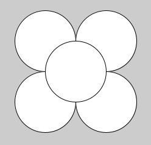
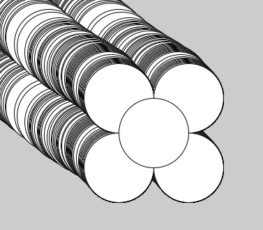

# Beginnen met Processing

In de eerste week van deze module starten we samen met een korte kennismaking en bespreken we wat we gaan leren en ook hoe we dat gaan doen. Daarna gaan we aan de slag met Processing en maken we een link vanuit de voorkennis die jullie al hebben. Zelf ga je ook aan de slag met online materiaal en natuurlijk ga je code schrijven in Processing. Aan het eind van de week kun je tekeningen maken in Processing die zelfs al een beetje interactie vertonen.

## Tijdens de les

- Korte kennismaking
- De syllabus tot hier
- Hoe ziet de module eruit?
- Hoe breng je deze module tot een goed einde?
- Processing voor Pythonprogrammeurs
- Processing installeren
  - Download de versie voor jouw besturingssysteem vanaf de [Processing site](https://processing.org/download)
  - Pak het .zip bestand uit (in het geval van Windows) en bewaar de uitgepakte map op een handige plaats
  - In die map staat processing.exe (Windows), dubbelklik om uit te voeren
  - Klik in het SmartScreen venster op Meer informatie en dan op Toch toestaan
  - Processing is nu gestart!
  - Klik met de rechtermuisknop op processing.exe om een link in je Start menu of op je bureaublad te plaatsen
- Eerste tekening met Processing

## Online materiaal

**Aanbevolen**:

- [Hello Processing!](https://hello.processing.org/) tutorial, door Daniel Shiffman et al

  Video's met interactieve editor // ongeveer 1 uur // Engels // Engelse ondertitels

  Een duidelijke, maar beknopte introductie voor Processing. Op deze site staan zes video's over tekenen met Processing, interactie en if-statements. Daarnaast is er een interactieve code editor, zodat je meteen met de voorbeelden kunt spelen. (Doe dat ook! Dingen uitproberen in de code is de beste manier om te leren!)

- [Processing Reference / Shape](https://processing.org/reference/#shape)

  Reference documentatie // Engels

  Bekijk onder het kopje Shape, 2d Primitives de verschillende functies die je kunt gebruiken om te tekenen. In de tutorial heb je `rect` en `ellipse` gezien, maar er zijn er nog meer. Klik op de functies voor meer informatie over hoe je die kunt gebruiken.

**Alternatieven**:

- Processing tutorials, ook door Daniel Shiffman

  Video's op YouTube // ongeveer 1:45 uur // Engels // Engelse ondertitels, vertaling mogelijk

  - [Deel 1](https://www.youtube.com/playlist?list=PLRqwX-V7Uu6bsRnSEJ9tRn4V_XCGXovs4) over tekenen op het scherm
  - [Deel 2](https://www.youtube.com/playlist?list=PLRqwX-V7Uu6Yo4VdQ4ZTtqRQ1AE4t_Ep9) over de Processing IDE en kleuren
  - [Deel 3](https://www.youtube.com/playlist?list=PLRqwX-V7Uu6by61pbhdvyEpIeymlmnXzD) (t/m 3.2) over interactie
  - [Deel 5](https://www.youtube.com/playlist?list=PLRqwX-V7Uu6YqykuLs00261JCqnL_NNZ_) (t/m 5.2) over if-statements

  Deze video's behandelen ongeveer dezelfde stof als de Hello Processing! tutorial, maar ze zijn al iets ouder en minder to-the-point. Aan de andere kant is het wel mogelijk om deze video's versneld af te spelen en de ondertitels te laten vertalen naar het Nederlands.

- Processing tutorials, door Casey Reas, Ben Fry en Daniel Shiffman

  Tekst // ongeveer 4900 woorden // Engels

  - [Getting started](https://processing.org/tutorials/gettingstarted) over de Processing IDE
  - [Coordinate System and Shapes](https://processing.org/tutorials/coordinatesystemandshapes) over tekenen op het scherm
  - [Color](https://processing.org/tutorials/color) over kleuren
  - [Interactivity](https://processing.org/tutorials/interactivity) (t/m Mouse buttons) over interactie, en een beetje over if-statements
  - Reference: [if](https://processing.org/reference/if.html) en [else](https://processing.org/reference/else.html) over if-statements

  Als je liever leest of snel iets terug wilt zoeken dan zijn deze geschreven tutorials een goede optie. Met name de tutorials over tekenen en kleuren zijn zeer overzichtelijk en snel door te nemen als je geen zin hebt om daar video's over te kijken. If-statements gaan hier wat kort door de bocht, maar als je nog weet hoe dat in een andere taal werkt, heb je hier waarschijnlijk wel genoeg aan.

- Processing Examples

  Code voorbeelden // Engelse beschrijving

  - [Coordinates](https://processing.org/examples/coordinates.html) over tekenen op het scherm, vooral de locatie waar je tekeningen terecht komen
  - [Shape Primitives](https://processing.org/examples/shapeprimitives.html) over de verschillende vormen die je kunt tekenen
  - [Mouse 1D](https://processing.org/examples/mouse1d.html) en [Mouse 2D](https://processing.org/examples/mouse2d.html) over interactie

  Dit zijn kleine voorbeeldprogramma's die gebruik maken van de concepten die in het andere materiaal worden uitgelegd. In het commentaar van het programma staat ook uitgelegd hoe dit werkt. Deze voorbeelden zijn handig als je vooral wilt weten hoe de code eruit moet zien (met alle `{`, `}` en `;` op de juiste plek). De beste manier om deze voorbeelden te gebruiken is door de code te kopiëren, uit te voeren en dan een beetje aan te passen.

- Programmeren in Processing, door David Fokkema

  Tekst // ongeveer 1300 woorden // Nederlands

  - [Werken met Processing](https://davidfokkema.github.io/project-programmeren/index.html) over de IDE, tekenen en kleuren
  - [Als-dan beslissingen](https://davidfokkema.github.io/project-programmeren/alsdan.html) over if-statements

  In het Nederlands is er helaas niet veel te vinden over Processing. Deze twee pagina's geven een korte introductie van een aantal tekenfuncties, maar hoe je de locatie aangeeft wordt niet duidelijk uitgelegd, dus daarvoor moet je toch bij een van de andere bronnen kijken. Dat geldt ook voor interactie. De pagina over if-statements is wel een redelijke introductie, maar vertelt je niet over `else`.

## Oefeningen

Als je de interactieve tutorial hebt volgt, heb je tussendoor al veel kunnen oefenen. (En hopelijk heb je dat ook gedaan.) Hieronder staan nog wat meer oefeningen om Processing beter te leren kennen en gewend te raken aan de syntax. Voel je vrij om een andere weg te kiezen en iets moois te maken zodra je een leuk idee hebt!

### Processing leren kennen

:::{exercise} Coördinaten en kleuren
Beantwoord deze vragen voordat je de code uitvoert! Zoek eventueel de functie op in de [Processing Reference](https://processing.org/reference) als je het niet weet. Voer daarna de code uit in Processing om te kijken of je het inderdaad begrijpt.

1. Waar komt er een punt op je scherm te staan als je `circle(0, 0, 1)` uitvoert?
2. Geeft `line(1, 1, 10, 1)` een horizontale of verticale lijn?
3. Welke kleur krijgt een rechthoek als je `fill(255, 255, 0)` gebruikt?
:::

:::{exercise} Bloemetje
We tekenen een bloemetje met vijf cirkels van 100 pixels breed.

1. Teken je de middelste cirkel als eerste of als laatste?

2. Schrijf een programma dat deze bloem natekent. Begin je programma met de regel `size(400, 400);` en voeg daarna de vijf cirkels toe.

   

       
Lukt het niet om de cirkels op de juiste plek te krijgen? Klik hier voor een hint.

       De middelste cirkel staat op punt (200, 200). De andere cirkels staan op (150, 150), (150, 250), (250, 150) en (250, 250). Welke vorm krijg je als je die punten verbindt?
   

3. Vergeet expres een `;` achter een van de regels. Welke foutmelding krijg je?

4. Geef je bloem een mooie kleur. Kun je de bladeren verschillende kleuren geven? Probeer ook de dikte van de lijn te variëren met `strokeWeight` of `noStroke` (zoek in de Reference wat die functies doen). Wat geeft het mooiste resultaat?
:::

### Interactieve sketches

:::{exercise} Je wordt gestalkt (door een bloemetje)
Pas je bloemetje uit de vorige opdracht aan zodat het midden van het bloemetje op de positie van de muis getekend wordt, dus op coördinaat (`mouseX`, `mouseY`).

1. Vervang de `200, 200` coördinaten in je programma door `mouseX` en `mouseY`. Hoever zat elk bloemblad vanaf het midden in de oude tekening? Hoe zorg je ervoor dat de bladen net zover vanaf het nieuwe midden zitten?

2. Probeer je programma uit te voeren. Als je de vorige opdracht zonder `setup()` en `draw()` hebt gemaakt, werkt het programma nu niet. Waarom niet?

3. Voeg `void setup() {}` en `void draw() {}` toe aan je programma. Welke regels komen nu in `setup` en welke komen in `draw` te staan?

4. Welke regel moet je nog toevoegen als je programma er nu zo uit ziet?

   
:::

:::{exercise} Bloemetjes planten

Verander je programma uit de vorige opdracht zo dat er alleen een bloemetje wordt getekend als je de muisknop indrukt, zodat je meerdere bloemen kunt planten.

1. Heb je nu wel of geen `background` nodig?
2. Zoek in de [Reference](https://processing.org/reference/#input-mouse) onder Input > Mouse naar de juiste variabele om te detecteren of de muisknop is ingedrukt. Hoe kun je die gebruiken?

Kun je je programma nog verder uitbreiden? Bijvoorbeeld door steeltjes toe te voegen, of meer blaadjes te maken? Probeer eens de `quad` functie om een geruit bloemetje te maken! Kun je het bloemetje elke keer dat je klikt een andere kleur geven? Welke vormen kun je gebruiken om een bloemenperkje te tekenen om je bloemen in te planten? Kun je er ook voor zorgen dat je alleen binnen dat perkje bloemen neer kunt zetten? Vergeet niet dat je het venster groter kunt maken door de getallen in `size` aan te passen!

:::