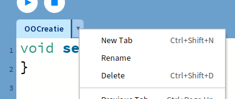

# Objectgeoriënteerd programmeren

Deze week hebben we een fysieke les, waarin we eerst wat tijd besteden aan kennis maken met elkaar. Daarna gaan we beginnen met objectgeoriënteerd programmeren, op basis van de creatie die je vorige week gemaakt hebt. Daarna is er tijd om met je eigen project aan de slag te gaan en daarover te sparren met klasgenoten. Aan het eind van de week kun je programma opdelen in verschillende classes en de basis daarvan programmeren in Processing.

## Tijdens de les

- Introductie objectgeoriënteerd programmeren: de dierentuin
- Aan de slag met je project

## Online materiaal

**Aanbevolen**:

- Processing tutorials, door Daniel Shiffman

  Video's op YouTube // ongeveer 1:07 uur // Engels // Engelse ondertitels, vertaling mogelijk

  - [Deel 7](https://www.youtube.com/playlist?list=PLRqwX-V7Uu6ajGB2OI3hl5DZsD1Fw1WzR) over functies

    7.1 geeft een introductie van objectgeoriënteerd programmeren en functies, met name het doel dat we ermee willen bereiken. 7.2 t/m 7.4 gaan over functies en de principes daar komen je wellicht nog bekend voor uit Python, maar het ziet er in Processing natuurlijk wel anders uit. In 7.2 zie je precies hoe dat werkt in Processing. 7.3 en 7.4 gaan meer over de organisatie van code in functies en hoe je ervoor zorgt dat je een functie kan hergebruiken.

  - [Deel 8](https://www.youtube.com/playlist?list=PLRqwX-V7Uu6bb7z2IJaTlzwzIg_5yvL4i) (t/m 8.4) over objectgeoriënteerd programmeren

    8.1 is een introductie van objectgeoriënteerd programmeren en legt je het verschil uit tussen een class en een object. 8.2 en 8.3 gaan concreet over de code en de syntax van een class in Processing. 8.4 is vergelijkbaar met 7.4, maar dan voor classes: hoe kun je een class hergebruiken?

**Alternatieven**:

- Processing tutorials, ook door Daniel Shiffman

  Tekst // ongeveer 2600 woorden // Engels

  - [Objects](https://processing.org/tutorials/objects) over objectgeoriënteerd programmeren

- Processing Examples

  Code voorbeelden // Engelse beschrijving

  - [Objects](https://processing.org/examples/objects.html), een programma met een class en vier objecten

## Project

1. Maak een schets van jouw project. Wat zijn de belangrijke elementen? 

   (Deze schets is niet heilig en je mag in de komende weken alles veranderen, maar het is nuttig om een idee te hebben waar je ongeveer heen wilt.)

2. Welke objecten zijn er in jouw ontwerp? Welke classes moet je dan in je project definiëren? Heb je meerdere objecten van dezelfde class? 

   (Ook hier: je mag in de komende weken nog veel meer classes toevoegen als dat handiger blijkt, het gaat erom dat je op een objectgeoriënteerde manier naar je ontwerp kijkt.)

3. Start je project in Processing: maak de classes die je bedacht hebt, geef ze een simpele display functie (al is het maar alleen een rechthoek van ongeveer de juiste afmeting) en probeer dingen ongeveer op de juiste plek te zetten.

4. Begin met het mooier tekenen van de objecten in je project. Gebruik alle vormen en kleuren die je in de vorige weken geleerd hebt.

## Oefeningen

:::{exercise} Een class voor je creatie
:label: ex-creatie-class

Vorige week heb je een creatie gemaakt die zich op een locatie (x, y) bevindt. Die creatie is een ding op zich, en dus de ideale kandidaat voor een object.

1. Maak een nieuwe sketch met de `setup` en `draw` functies in de hoofdtab. Geef je sketch in `setup` een logische grootte (met genoeg ruimte voor je creatie) via `size` en teken eventueel een achtergrond in `draw`. 

2. Voeg een extra tab toe aan deze sketch door te klikken op het pijltje naast de naam van je sketch en dan de knop *New Tab*. Geef deze tab de naam van jouw creatie. Gebruik hierbij alleen letters (geen cijfers, spaties of speciale tekens!) en zorg daarbij dat de eerste letter een hoofdletter is. Als je meerdere woorden gebruikt, begint elk woord met een hoofdletter: bijvoorbeeld `MijnCreatie`.

   

3. In deze tab maken we een class aan die beschrijft hoe de creatie werkt. Begin met deze code voor een lege class:

   ```java
   class MijnCreatie {
       
   }
   ```

   Gebruik voor de class dezelfde naam als je aan de tab hebt gegeven! Zo blijft je sketch overzichtelijk en kun je snel iedere class terugvinden.

4. Jouw creatie heeft (minstens) twee eigenschappen: de x-positie en de y-positie. Voeg dus binnen de class twee fields toe om die waardes op te slaan:

   ```java
   class MijnCreatie {
     float x;
     float y;
   }
   ```

5. Jouw creatie heeft tot nu toe één belangrijke functionaliteit: zichzelf tekenen op het scherm. Voeg in de class een methode genaamd `display` toe waarin je de code zet die jouw creatie tekent. Gebruik hier `this.x` en `this.y` om te verwijzen naar de `x` en `y` fields in de class. Deze methode geeft geen waarde terug, dus als returntype gebruiken we `void`. De methode heeft ook geen argumenten nodig:

   ```java
     void display() {
       // Code die de creatie tekent
       circle(this.x, this.y, 200);
     }
   ```

6. Tot slot hebben we in de class nog een manier nodig om creaties te maken. Daarvoor voegen we een constructor toe aan de class: dit is de code die uitgevoerd wordt op het moment dat we een object maken volgens de beschrijving van deze class. Bij het maken van de creatie, willen we de locatie aangeven waar de creatie moet komen te staan, dus krijgt de constructor twee argumenten `x` en `y`:

   ```java
     MijnCreatie(float x, float y) {
       this.x = x;
       this.y = y;
     }
   ```

   In de code van de constructor zetten we die waardes dan in de `x` en `y` fields van de class, die we bij stap 4 gemaakt hebben. Omdat beide dezelfde naam hebben, moeten we `this.` gebruiken om aan te geven dat de variabelen voor de `=`-tekens de fields van de class zijn.

De bouwtekening voor de creatie is nu af! Als je de sketch uitvoert, zul je echter nog geen creaties op je scherm zien: we hebben namelijk nog geen object van deze creatie gemaakt.

7. Voeg terug in de hoofdtab van je programma een nieuwe variabele toe waarin je je jouw creatie kunt opslaan. Zet deze buiten de `setup` en `void` functies, zodat de variabele in beide beschikbaar is.

   ```java
   MijnCreatie mijnCreatie;
   ```

   Variabelenamen beginnen altijd met een kleine letter, maar om woorden van elkaar te onderscheiden, beginnen de volgende woorden in de naam wel met een hoofdletter. Kies uiteraard een naam die logisch is voor jouw creatie!

8. Voeg een regel in `setup` toe waarmee je een nieuwe creatie maakt en opslaat in de variabele uit stap 7:

   ```java
     mijnCreatie = new MijnCreatie(200, 200);
   ```

   De twee waardes tussen haakjes zijn de `x` en de `y` argumenten voor de constructor, dus kies een logische plaats om je creatie te tekenen.

9. Tot slot moeten we nog aan de creatie vragen om zichzelf te tekenen. Voeg in `draw` deze regel toe:

   ```java
     mijnCreatie.display();
   ```

Voer je sketch uit. Je hebt nu van jouw creatie een class gemaakt, die je makkelijk kan hergebruiken. Je ziet ook dat de hoofdtab veel overzichtelijker is geworden: alle details over hoe de creatie eruit ziet, staan nu bij de creatie en hier hoeven we alleen nog te weten dat die creatie getekend wordt.

:::

:::{exercise} Creaties clonen met classes

In {ref}`ex-creaties-clonen` heb je meerdere creaties getekend door de tekencode te herhalen met een loop. Nu je jouw creatie in class hebt gezet, kun je ook meerdere creaties maken die onafhankelijk van elkaar opereren. (Nu doen de creaties natuurlijk nog niet zo veel, maar daar komt nog wel verandering in!) Voeg een extra variabele toe aan je sketch voor een tweede creatie (bijvoorbeeld `mijnCreatie2`). Maak voor deze creatie en een nieuw object in `setup` en teken de tweede creatie in `draw`.

:::

:::{exercise} Creatievariatie

De enige eigenschappen die je creatie nu heeft zijn de `x` en `y` positie. Voeg een extra eigenschap toe (bijvoorbeeld een kleur, of ...) aan je creatie en zorg dat je die eigenschap ook kunt meegeven via de constructor. Maak nu verschillende objecten van je creaties waarin je die eigenschap varieert en teken ze allemaal in je sketch.

:::

:::{exercise} Alles is mooier met een bloemetje

Maak in je sketch nog een nieuwe class (volgens de stappen in {ref}`ex-creatie-class`) voor het bloemetje uit de oefeningen van week 1. Voeg ook eigenschappen aan het bloemetje toe om mee te variëren, bijvoorbeeld kleuren en de grootte van de bladeren. Combineer jouw creatie met meerdere bloemetjes in één sketch.

:::
