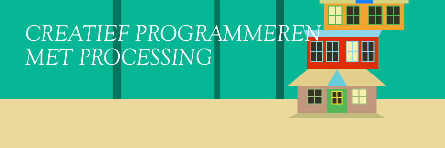

# Creatief Programmeren met Processing

<!-- Deze regel niet wijzigen! -->
*Versie {{ versie }}. Jouw docent: {{ docent }} ({{ docent_email }})*



Welkom bij de module Creatief Programmeren met Processing! In deze module ga je aan de slag met de programmeertaal **[Processing](https://processing.org/)**, waarmee je **creatieve visuele programma’s en animaties** kunt maken. Je leert ook hoe je een programma uit kleinere blokjes kunt opbouwen met **objectgeoriënteerd programmeren**. Daardoor kun je ook een groot en ingewikkeld programma overzichtelijk houden, waardoor het voor anderen (en voor jezelf volgende week) makkelijker te begrijpen is hoe het programma werkt.

Als je aan deze module begint, gaan we ervan uit dat je al **een beetje ervaring hebt met programmeren**. Bijvoorbeeld uit de module Basis van Programmeren met Python, maar via een andere weg in een andere taal is natuurlijk ook goed. We verwachten dat je bekend met variabelen, print-statements, if- en else-statements en loops. Het is niet erg als dat een beetje is weggezakt: in de eerste lessen gaan we al deze onderwerpen herhalen en vertalen naar Processing. We hebben echter geen tijd om hier uitgebreid mee te oefenen, dus als je deze termen voor het eerst hoort, wordt dit een lastige module!

We hebben **twee doelen** deze module, zodat je aan het eind van deze module mag zeggen: ik kan ... 

- creatieve en interactieve programma’s creëren met Processing.
- de basisprincipes van objectgeoriënteerd programmeren toepassen in mijn eigen programma’s.

Om te laten zien dat je deze leerdoelen gehaald hebt, lever je aan het eind van de module een **eindopdracht** in: dit is een creatief en interactief programma dat je in Processing gemaakt hebt en waarin je natuurlijk de basisprincipes van objectgeoriënteerd programmeren hebt toegepast. Om je een beetje op weg te helpen, kiezen we elk blok een thema voor deze opdracht: deze keer is het thema **{{ thema }}**. Meer informatie vind je bij {doc}`eindopdracht`.

De **deadlines** voor deze module zijn:

- Inleveren van de eindopdracht: {{ deadline }}
- Aanvragen van uitstel: {{ deadline_uitstel_aanvragen }}
  - Uitgestelde deadline: {{ deadline_uitstel }}


Tot slot nog een paar **handige links**:

- [Processing dowloaden](https://processing.org/download)
- [Processing Reference](https://processing.org/reference) - hier staan alle functies van Processing beschreven
- [OpenProcessing](https://openprocessing.org/browse) - website waar mensen programma's delen gemaakt met p5.js, een JavaScript variant van Processing

---

```{tableofcontents}
```
